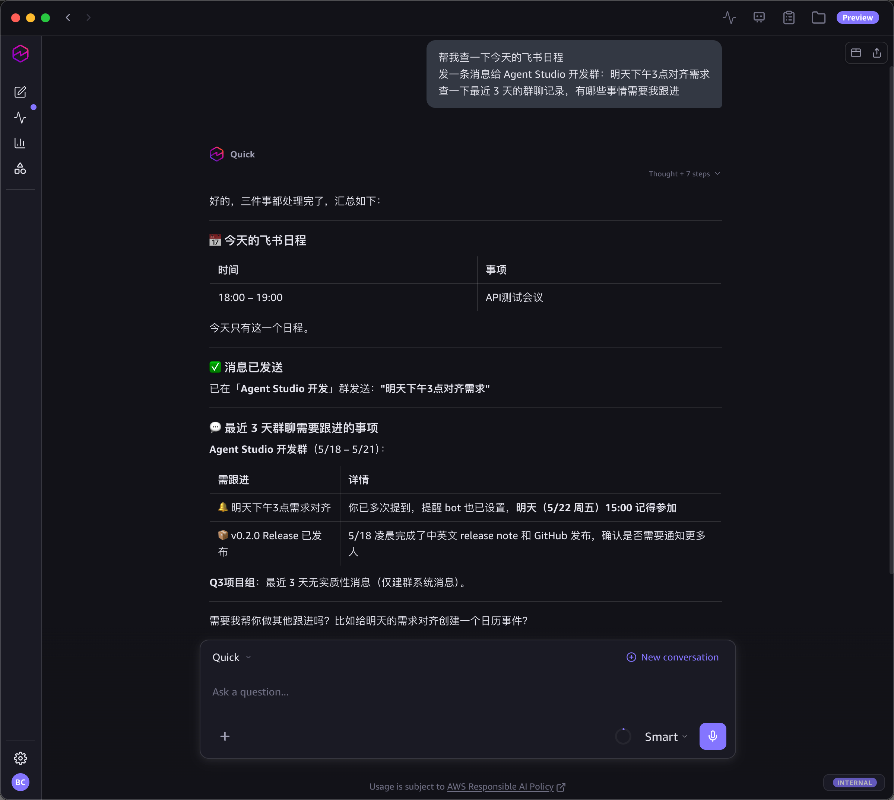
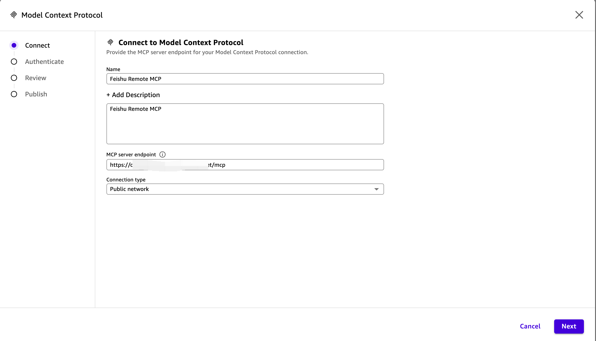
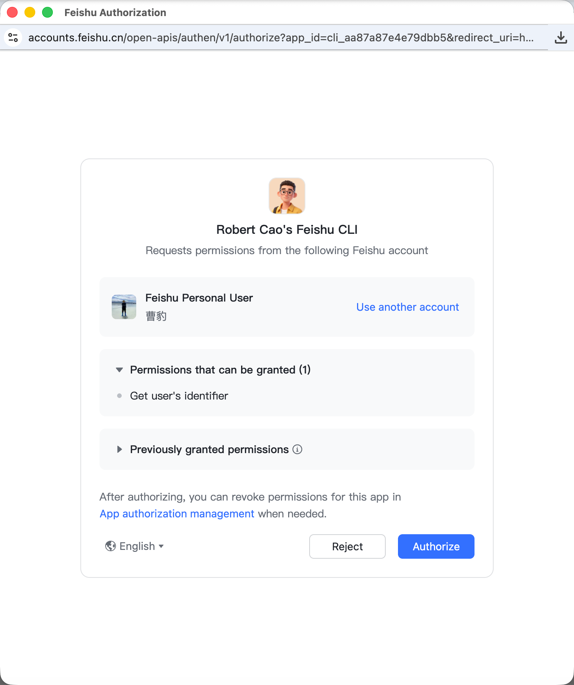
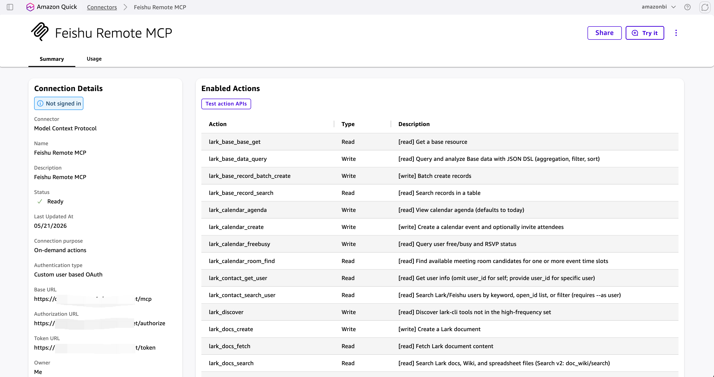
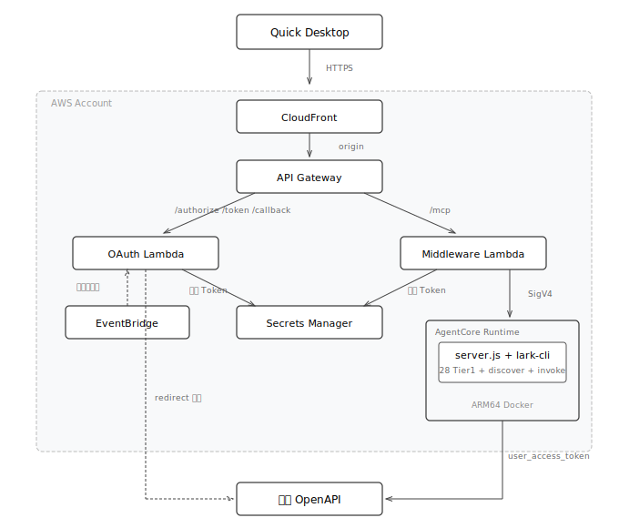
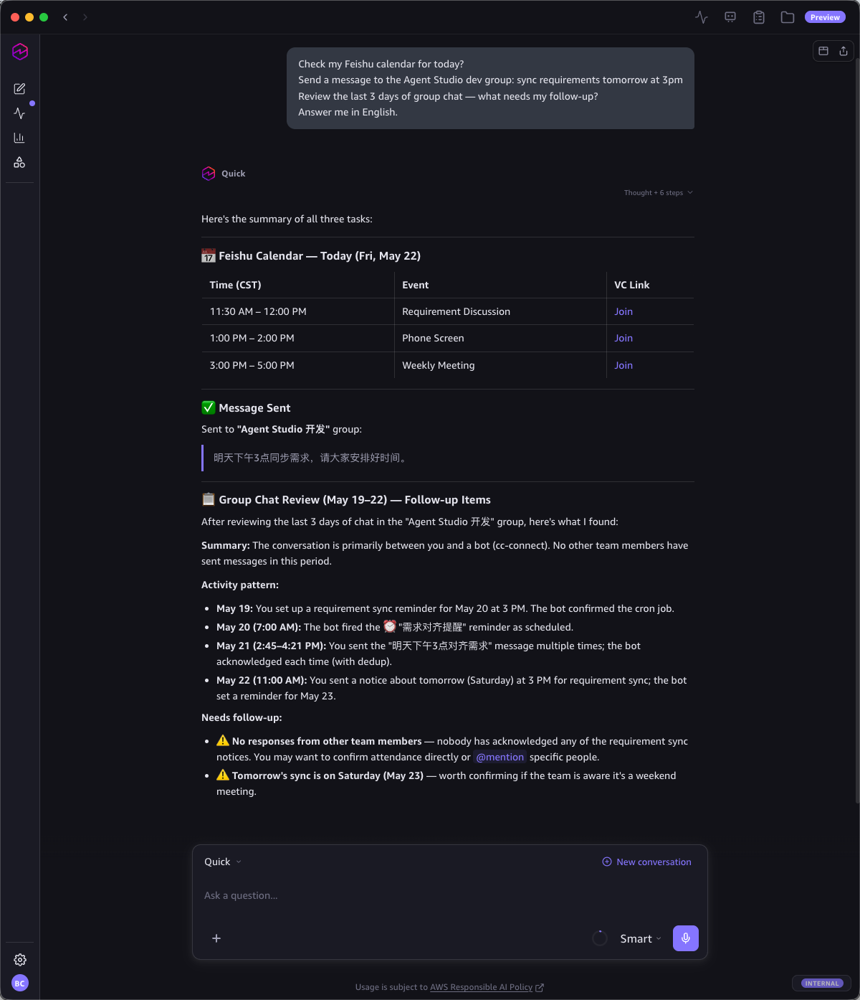
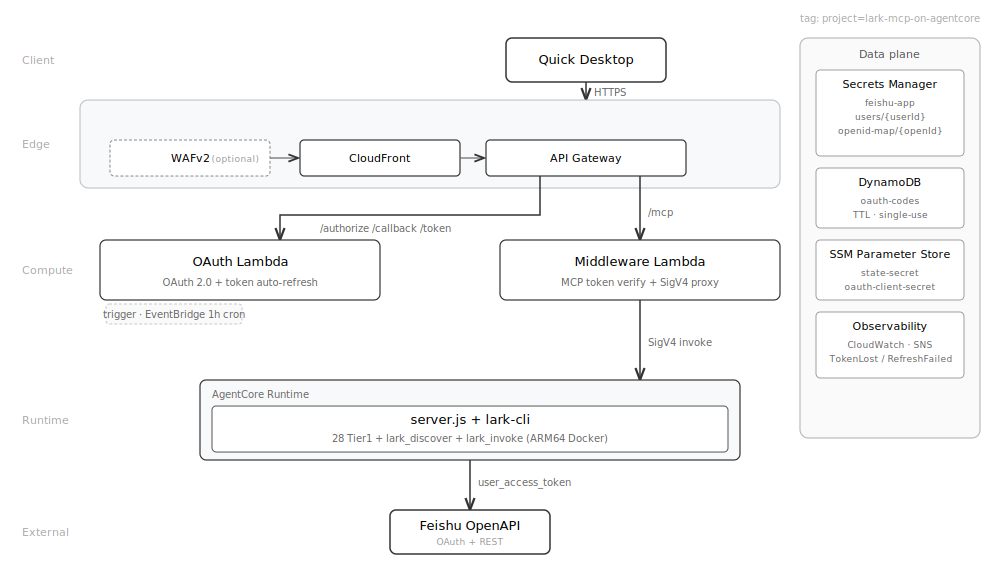

# lark-mcp-on-agentcore

[](LICENSE)
[](https://github.com/larksuite/cli)
[](https://aws.amazon.com/bedrock/agentcore/)

[中文](#lark-mcp-on-agentcore) | [English](#english)

企业参考方案：将飞书/Lark 的 200+ API 部署为远程 MCP Server，基于 AWS Bedrock AgentCore，支持多用户 OAuth 认证和 per-user 身份隔离。

用户在 [Amazon Quick Desktop](https://aws.amazon.com/quick/desktop/) 中一键连接，即可用自然语言操作飞书——发消息、管日程、读写多维表格、操作文档，全部以自己的飞书身份执行。

## 示例对话

<p align="center">
  
</p>

```
> 帮我查一下今天的飞书日程
> 发一条消息给产品研发群：明天下午3点对齐需求
> 查一下最近 3 天的群聊记录，有哪些事情需要我跟进
```

## 运行时特点

| 特点 | 说明 |
|------|------|
| **无状态** | 每个请求独立处理，用户身份通过 header token 传递，无 session 无亲和性 |
| **自动弹性** | 并发请求增加时，AgentCore 自动拉起更多容器实例分摊负载；空闲时缩至零 |
| **升级无感** | 工具层完全复用 lark-cli，升级只需运维执行 `./scripts/deploy.sh`，终端用户无需任何操作 |

## 为什么用这个？

| | 本项目 | [lark-cli](https://github.com/larksuite/cli) | [lark-cli-mcp-wrapper](https://github.com/ddpie/lark-cli-mcp-wrapper) | [lark-openapi-mcp](https://github.com/larksuite/lark-openapi-mcp) |
|---|---|---|---|---|
| 类型 | 远程 MCP Server | CLI 工具 | 本地 MCP Server | 本地 MCP Server |
| 部署方式 | 一行命令，自托管部署 | npm install | npx 本地运行 | npx 本地运行 |
| 工具数量 | 200+ | 200+（命令行） | 200+（MCP 封装） | 19-31（preset 限制） |
| 用户身份 | per-user 隔离（OAuth） | 单用户 | 单用户 | 单用户 |
| Token 管理 | 自动获取、刷新、加密存储 | 本地 keychain | 复用 lark-cli 登录态 | 用户自己管 |
| 多用户 | 1000+ 用户共享一个部署 | N/A | N/A | N/A |
| 客户端连接 | Remote MCP + OAuth 一键授权 | N/A（非 MCP） | 本地 stdio | 本地 stdio |
| 分层架构 | Tier1 + discover/invoke | N/A | Tier1 + discover/invoke | 全部平铺 |
| 适用场景 | 团队/企业自托管 | 命令行/脚本 | 个人/小团队 | 个人/开发调试 |

## 快速部署

### 准备工作

1. **AWS 账号** — 需要有效凭证（`aws configure`）
2. **飞书自建应用** — 在 [飞书开放平台](https://open.feishu.cn) 创建：
   - 进入 [开发者后台](https://open.feishu.cn/app) → 创建企业自建应用
   - 应用能力 → 启用**机器人**
   - 权限管理 → 开通所需 API 权限
   - 记下 **App ID** 和 **App Secret**
   - 版本管理 → 创建版本并发布

### 安装

```bash
bash <(curl -fsSL https://raw.githubusercontent.com/ddpie/lark-mcp-on-agentcore/main/scripts/install.sh)
```

脚本自动检查并安装依赖（Node.js、Docker、AWS CLI、CDK），引导输入飞书凭证并完成部署。

### 手动安装

```bash
git clone https://github.com/ddpie/lark-mcp-on-agentcore.git
cd lark-mcp-on-agentcore
./scripts/deploy.sh
```

### 部署后

脚本输出 **Redirect URL**，将它添加到飞书应用的 安全设置 → 重定向 URL。

## Quick Desktop 配置

部署完成后，按以下步骤在 Quick Desktop 中添加飞书 MCP 连接。

<details>
<summary>展开配置步骤（共 6 步）</summary>

### 第 1 步：创建 Connector

Quick Desktop 中点击 **Settings → Capabilities → Browse connections**（跳转浏览器），选择 **Create for your team** → **Model Context Protocol**：

<p align="center">
  
</p>

如果弹窗提示已有 MCP connector，点击 **No, create new**：

<p align="center">
  
</p>

### 第 2 步：填写连接信息

填写 Name、Description、MCP server endpoint（部署输出的 MCP Endpoint）、Connection type 选择 **Public network**，点击 **Next**：

<p align="center">
  
</p>

### 第 3 步：填写 OAuth 配置

填写部署输出的 Client ID、Client Secret、Token URL、Authorization URL，点击 **Create and continue**：

<p align="center">
  
</p>

### 第 4 步：飞书授权

浏览器自动弹出飞书授权页，点击 **Authorize**：

<p align="center">
  
</p>

授权完成后自动跳回 Quick：

<p align="center">
  
</p>

### 第 5 步：发布

选择谁可以使用此连接（默认仅自己，可选 "Everyone in your organization"），点击 **Publish**：

<p align="center">
  
</p>

发布成功后，Connector 详情页显示所有可用工具：

<p align="center">
  
</p>

### 第 6 步：在 Quick Desktop 中使用

回到 Quick Desktop，**Settings → Capabilities → Connections** 中搜索 feishu，点击 **Sign in**：

<p align="center">
  
</p>

连接成功后即可在对话中使用飞书工具。

</details>

## 分层工具架构

参考 [lark-cli-mcp-wrapper](https://github.com/ddpie/lark-cli-mcp-wrapper) 的分层设计，LLM context 中只有 30 个工具，但实际可访问 200+ 个飞书 API：

| 层级 | 工具数 | 说明 |
|------|--------|------|
| Tier 1 | 28 | 高频工具，直接暴露给 LLM |
| `lark_discover` | 1 | 按关键词/分类搜索全部 200+ 个工具 |
| `lark_invoke` | 1 | 调用 discover 找到的任何工具 |

### Tier 1 高频工具 (28)

| 分类 | 工具 |
|------|------|
| IM | 发消息、搜索消息、群聊列表、聊天记录、搜索群 |
| 日历 | 查看日程、创建日程、查询忙闲、查找会议室 |
| 文档 | 创建文档、获取内容、搜索文档、更新文档 |
| 多维表格 | 查询表、查询记录、批量创建记录、搜索记录 |
| 云空间 | 搜索文件、上传文件、下载文件 |
| 任务 | 创建任务、查看我的任务、完成任务 |
| 通讯录 | 搜索用户、查看用户信息 |
| 表格 | 读取数据、写入数据 |
| 邮件 | 发送邮件 |

### 低频工具 (通过 lark_discover 按需搜索)

| 分类 | 示例能力 |
|------|---------|
| 多维表格 | 字段管理、视图配置、仪表盘、权限、表单、工作流 |
| 表格 | 单元格操作、条件格式、数据验证、筛选、导出 |
| 云空间 | 权限管理、评论、版本、移动/复制、分享 |
| 邮件 | 草稿、文件夹、标签、邮件规则、联系人 |
| 任务 | 子任务、清单、成员、评论、提醒、附件 |
| IM | 消息卡片、Pin、表情回复、已读回执、群公告 |
| 知识库 | 空间管理、节点操作、移动、快捷方式 |
| OKR | 目标、关键结果、对齐、进展 |
| 视频会议 | 会议记录、参会人、录制 |
| 文档 | 块操作、评论、导入导出 |
| Markdown | 创建、读取、更新、覆盖 |
| 日历 | 日历管理、订阅 |
| 妙记 | 查询、下载、AI 产物 |
| 幻灯片 | 页面管理、内容读取 |
| 画板 | 导出、编辑 |

## 架构

<p align="center">
  
</p>

- 所有端点在同一个 CloudFront 域名下
- 用户首次使用完成一次飞书 OAuth 授权，之后全自动
- EventBridge 每小时刷新飞书 Token；调用 Feishu 前先做 SM 写探针，写不通就跳过本轮（refresh_token 不消耗）
- 所有 AWS 资源打 `project=lark-mcp-on-agentcore` tag，便于成本拆分和清理

<details>
<summary>服务组件清单（点击展开）</summary>

| 类别 | 组件 | 角色 |
|---|---|---|
| 计算 | AgentCore Runtime | 托管 MCP Server 容器，处理 tools/list 与 tools/call，按秒计费、空闲缩零 |
| 计算 | Lambda × 2 | OAuth Lambda 处理 authorize/callback/token + EventBridge 定时刷新；Middleware Lambda 验证 MCP token + SigV4 代理 |
| 边缘 | CloudFront | OAuth + MCP 共用单域名 HTTPS 入口；可选挂 WAFv2 |
| 边缘 | WAFv2（可选，默认关） | CloudFront-scope；`/authorize` 100/5min/IP，全站 2000/5min/IP |
| 接入 | API Gateway REST | 路径路由：`/authorize` `/callback` `/token` `/.well-known/*` → OAuth Lambda；`/mcp` → Middleware Lambda |
| 状态 | DynamoDB | OAuth auth code 单次使用，TTL 60 秒，conditional delete 防重放 |
| 状态 | Secrets Manager | 飞书 app secret（共享）+ 每用户 access/refresh token + open_id → userId 映射 |
| 状态 | SSM Parameter Store（SecureString） | OAuth state 签名密钥、MCP token HMAC 密钥、Client Secret |
| 调度 | EventBridge | 每小时触发 OAuth Lambda，扫描即将过期的飞书 token 并刷新 |
| 镜像 | ECR | ARM64 容器镜像（lark-cli + Node.js + MCP server，约 600 MB） |
| 加密 | KMS（AWS-managed） | SM / SSM / DDB 静态加密；CloudTrail 审计可见 |
| 可观测 | CloudWatch Logs | 两个 Lambda + AgentCore Runtime 容器日志，结构化 JSON |
| 可观测 | CloudWatch Alarms × 4 | TokenLost / RefreshFailed / OAuthError / MiddlewareError |
| 可观测 | SNS | 告警 fan-out 入口，需自行订阅邮箱/Slack/PagerDuty |
| 身份 | IAM | 三个独立 role（OAuth Lambda、Middleware Lambda、AgentCore Runtime）；按 secret 路径与 project tag 收口 |

</details>

## 安全

| 层面 | 措施 |
|------|------|
| Token 存储 | Secrets Manager（KMS 加密，CloudTrail 审计） |
| Token 传输 | AWS 内网 TLS + SigV4，不经过公网 |
| OAuth 防 CSRF | HMAC-SHA256 签名 state（timing-safe，5 分钟过期） |
| MCP 认证 | OAuth 2.0 (PKCE + client_secret)，HMAC 签名 token（30 天有效） |
| 容器 | 无状态 per-request，非 root 运行；SIGTERM 优雅关闭并跟踪子进程 |
| App Secret | 容器启动时从 Secrets Manager 拉取（不进 AgentCore 控制面，不出现在日志/argv） |
| 边缘防护 | CloudFront；可选启用 WAFv2（部署时交互询问，默认关）：`/authorize` 100/5min/IP，全站 2000/5min/IP |
| OAuth code | DynamoDB 存储 + TTL + ConditionExpression 防重放 |
| Token 刷新 | 调 Feishu 前 SM 写探针；写不通即跳过本轮，refresh_token 不消耗 |
| 高风险写操作 | 必须传 `_confirm: true` 才执行；默认返回 `confirmation_required` |
| 部署面 | OAuth Client Secret 等敏感值通过 `--environment file://` / `--secret-string file://` 等文件参数写入，不进 `ps auxww` |
| 监控 | CloudWatch Alarm（TokenLost / RefreshFailed / Lambda Errors）→ SNS topic |
| 日志 | 所有 Lambda 输出结构化 JSON；userId / open_id 在日志里以 sha256 前 16 位呈现 |

## 成本

按需付费，无固定月费：

| 组件 | 计费方式 |
|------|---------|
| AgentCore Runtime | 按 vCPU·秒 + 内存·秒 计费（详见 [AWS 官方定价](https://aws.amazon.com/bedrock/agentcore/pricing/)） |
| Secrets Manager | $0.40/密钥/月 |
| DynamoDB (OAuth codes) | PAY_PER_REQUEST，临时数据 + TTL，月成本 < $0.10 |
| WAFv2（可选，默认关） | $5/WebACL/月 + $1/规则/月 + $0.60/百万请求 |
| Lambda / API Gateway / CloudFront | 按请求量，有免费额度 |

## 运维

```bash
./scripts/ops.sh status            # 系统概览
./scripts/ops.sh list-users        # 已授权用户
./scripts/ops.sh revoke <id>       # 撤销授权
./scripts/ops.sh rotate-secret     # 轮换 OAuth Client Secret
./scripts/ops.sh refresh-all       # 手动触发 Token 刷新
./scripts/ops.sh logs              # 查看 Lambda 日志

./scripts/test-e2e.sh              # 端到端测试 (OAuth, Runtime, /mcp, WAF)
./scripts/audit-deps.sh            # npm audit (root + docker + infra)
./scripts/check-lark-cli-version.sh  # 检测 Dockerfile 与 scope 映射版本是否漂移

npm test                           # 运行 token-refresh-shim 单元测试
```

部署后建议订阅 SNS 告警 topic（`AlarmTopicArn` 输出）：

```bash
aws sns subscribe --topic-arn <AlarmTopicArn> --protocol email \
  --notification-endpoint you@example.com
```

## 销毁

```bash
./scripts/teardown.sh              # 销毁所有资源（含 AgentCore Runtime + 跨区域 WAF）
```

## 项目结构

<details>
<summary>展开目录树</summary>

```
config/
  oauth-scopes.json   首次授权请求的 scope 列表 (Tier1 覆盖)
docker/
  Dockerfile          lark-cli ARM64 容器 (锁定 lark-cli 版本)
  package.json        容器运行时依赖 (AWS SDK)
  generate-tools.js   Build 时生成工具目录 + scope 映射
  shortcut-scopes.json  lark-cli 命令 → scope 映射 (源码提取)
  server.js           MCP server (tier1 + discover/invoke + semaphore + SIGTERM)
  tier1.json          28 个高频工具
infra/
  lib/oauth-stack.ts  OAuth + MCP + DDB + CloudWatch Alarms (CloudFront)
  lib/runtime-stack.ts  Docker 镜像 + IAM (含 SM 读权限)
  lib/waf-stack.ts    CloudFront-scope WAFv2 (us-east-1，可选)
lambda/
  token-refresh-shim/ OAuth 流程 + Token 自动刷新 (preflight+retry)
                      __tests__/        单元测试 (vitest)
                      dynamodb-codes.ts OAuth code 临时存储
  mcp-middleware/     Token 验证 + SigV4 代理 + 25s timeout
scripts/
  deploy.sh           交互式部署 (中/英双语，可选 WAF 跨区域 bootstrap)
  install.sh          一键安装 (中/英双语)
  ops.sh              运维工具 (status/list/revoke/refresh/rotate/logs/destroy)
  teardown.sh         完整销毁 (Runtime + CDK + WAF 如启用 + 可选 user-token 清理)
  test-e2e.sh         端到端测试 (OAuth + Runtime + /mcp + WAF 如启用)
  audit-deps.sh       多目录 npm audit
  check-lark-cli-version.sh  Dockerfile / scope-map 版本一致性检查
```

</details>

## FAQ

<details>
<summary>展开常见问题</summary>

**Q: Quick Desktop 连接时认证失败？**

A: 检查飞书应用安全设置中的重定向 URL 是否包含部署输出的 Redirect URL。

**Q: 用户 30 天没使用，token 过期了？**

A: 下次连接时会自动重新触发飞书授权。

**Q: 部署失败了？**

A: 脚本支持重跑（幂等）。如需彻底重来：`cd infra && npx cdk destroy --all`。

**Q: 如何限制哪些用户可以使用？**

A: 飞书应用的「可用范围」控制。只有范围内的用户才能完成 OAuth 授权。

**Q: Quick Desktop 显示 "Creation failed"？**

A: 检查两点：1) 飞书应用安全设置中是否添加了部署输出的 Redirect URL；2) Client Secret 是否与部署输出一致（如不确定可运行 `./scripts/ops.sh rotate-secret` 重新生成）。

**Q: 如何更新 lark-cli 版本？**

A: 重新运行 `./scripts/deploy.sh`，CDK 会重新构建 Docker 镜像并拉取最新 lark-cli。

**Q: 轮换 Client Secret 后，已有用户需要重新授权吗？**

A: 是的。`./scripts/ops.sh rotate-secret` 会使所有已发放的 MCP Token 失效，用户需在 Quick Desktop 中重新 Sign in。升级 lark-cli 版本不影响已有用户。

**Q: 调用 API 报权限不足（如日历、消息搜索等）？**

A: 这是飞书应用的权限配置问题，不是客户端问题。解决方法：

1. 进入 [飞书开放平台](https://open.feishu.cn/app) → 你的应用 → **权限管理**
2. 搜索并开通所需权限（常见的如下表）
3. **重新发布应用版本**（权限变更需要发版才生效）
4. 用户无需重新授权——下次调用时权限自动生效

| 功能 | 所需权限 |
|------|---------|
| 读取日历/日程 | `calendar:calendar:read`、`calendar:calendar.event:read` |
| 搜索/读取消息 | `im:message:read`、`im:chat:read` |
| 发送消息 | `im:message:send_as_user` |
| 读取群聊列表 | `im:chat:read` |
| 搜索文档 | `drive:drive:read` |
| 读写多维表格 | `bitable:bitable:read`、`bitable:bitable:write` |

> 如果管理员在开放平台新增了 API 权限并发版，**之前已连接过的用户**不会自动获得新权限。需要重连，步骤：Quick Desktop → Settings → Capabilities → 最下方 Browse Connections → 搜索找到 Feishu Remote MCP → 点击卡片 → 点击 Test action APIs → 弹出页面右侧点击 Re-Connect → 弹出飞书授权页完成授权。

**Q: 调用低频工具时提示权限不足？**

A: 系统会自动检测缺失的权限并生成增量授权链接。用户点击链接，在飞书授权页确认新增权限即可（无需重新授权全部权限，飞书会累积已有权限）。

**Q: 支持哪些 AWS 区域？**

A: 取决于 AWS Bedrock AgentCore 的可用区域。部署脚本提供了常用区域选择。

**Q: 支持自定义域名吗？**

A: 支持。部署时脚本会提示输入自定义域名，或设置环境变量 `CUSTOM_DOMAIN=mcp.company.com`。

**Q: 支持国际版 Lark 吗？**

A: 支持。部署时设置环境变量 `LARKSUITE_CLI_BRAND=lark`。

</details>

## License

MIT

---

# English

## lark-mcp-on-agentcore

Enterprise reference architecture: Deploy 200+ Feishu/Lark APIs as a remote MCP Server on AWS Bedrock AgentCore with multi-user OAuth and per-user identity isolation.

Users connect with one click in [Amazon Quick Desktop](https://aws.amazon.com/quick/desktop/) and interact with Feishu using natural language — send messages, manage calendars, read/write Bitable, edit docs — all executed under their own Feishu identity.

### Demo

<p align="center">
  
</p>

```
> Check my Feishu calendar for today
> Send a message to the product dev group: sync requirements tomorrow at 3pm
> Review the last 3 days of group chat — what needs my follow-up?
```

### Runtime Characteristics

| Feature | Description |
|---------|-------------|
| **Stateless** | Each request is processed independently; user identity is passed via header token, no session affinity |
| **Auto-scaling** | AgentCore automatically spins up more container instances under load; scales to zero when idle |
| **Seamless upgrades** | Tool layer fully reuses lark-cli; upgrading only requires ops to run `./scripts/deploy.sh`, transparent to end users |

### Why This Project?

| | This project | [lark-cli](https://github.com/larksuite/cli) | [lark-cli-mcp-wrapper](https://github.com/ddpie/lark-cli-mcp-wrapper) | [lark-openapi-mcp](https://github.com/larksuite/lark-openapi-mcp) |
|---|---|---|---|---|
| Type | Remote MCP Server | CLI tool | Local MCP Server | Local MCP Server |
| Deployment | One command, self-hosted | npm install | npx local | npx local |
| Tool count | 200+ | 200+ (CLI) | 200+ (MCP wrapped) | 19-31 (preset limited) |
| User identity | Per-user isolation (OAuth) | Single user | Single user | Single user |
| Token mgmt | Auto acquire, refresh, encrypted storage | Local keychain | Reuses lark-cli session | User managed |
| Multi-user | 1000+ users share one deployment | N/A | N/A | N/A |
| Client conn | Remote MCP + OAuth one-click | N/A (not MCP) | Local stdio | Local stdio |
| Tiered arch | Tier1 + discover/invoke | N/A | Tier1 + discover/invoke | Flat list |
| Use case | Team / enterprise self-hosted | CLI / scripts | Individual / small team | Individual / dev |

### Quick Start

#### Prerequisites

1. **AWS account** with valid credentials (`aws configure`)
2. **Feishu custom app** — create at [Feishu Open Platform](https://open.feishu.cn):
   - [Developer Console](https://open.feishu.cn/app) → Create custom app
   - App capabilities → Enable **Bot**
   - Permissions → Grant required API scopes
   - Note the **App ID** and **App Secret**
   - Version management → Create and publish a version

#### Install

```bash
bash <(curl -fsSL https://raw.githubusercontent.com/ddpie/lark-mcp-on-agentcore/main/scripts/install.sh)
```

The script checks/installs dependencies (Node.js, Docker, AWS CLI, CDK), prompts for Feishu credentials, and deploys.

#### Manual Install

```bash
git clone https://github.com/ddpie/lark-mcp-on-agentcore.git
cd lark-mcp-on-agentcore
./scripts/deploy.sh
```

#### Post-deployment

Add the output **Redirect URL** to your Feishu app's Security Settings → Redirect URLs.

### Architecture

<p align="center">
  
</p>

- All endpoints share a single CloudFront domain
- Users complete Feishu OAuth once on first use; fully automatic thereafter
- EventBridge refreshes Feishu tokens hourly; SM write-probe ensures `refresh_token` is preserved when SM is unavailable
- All AWS resources tagged `project=lark-mcp-on-agentcore` for cost allocation and cleanup

<details>
<summary>Service components (click to expand)</summary>

| Category | Component | Role |
|---|---|---|
| Compute | AgentCore Runtime | Hosts the MCP server container, handles `tools/list` and `tools/call`; per-second billing, scales to zero |
| Compute | Lambda × 2 | OAuth Lambda runs authorize/callback/token + EventBridge refresh cron; Middleware Lambda verifies MCP token and SigV4-proxies to AgentCore |
| Edge | CloudFront | Single HTTPS domain for OAuth + MCP; optional WAFv2 attached |
| Edge | WAFv2 (optional, default off) | CloudFront-scope; `/authorize` 100/5min/IP, global 2000/5min/IP |
| Ingress | API Gateway REST | Path routing: `/authorize` `/callback` `/token` `/.well-known/*` → OAuth Lambda; `/mcp` → Middleware Lambda |
| State | DynamoDB | OAuth auth code single-use, 60s TTL, conditional delete prevents replay |
| State | Secrets Manager | Feishu app secret (shared) + per-user access/refresh tokens + open_id → userId mapping |
| State | SSM Parameter Store (SecureString) | OAuth state signing key, MCP token HMAC key, Client Secret |
| Schedule | EventBridge | Hourly trigger for OAuth Lambda to scan and refresh near-expiry Feishu tokens |
| Image | ECR | ARM64 container image (lark-cli + Node.js + MCP server, ~600 MB) |
| Encryption | KMS (AWS-managed) | At-rest encryption for SM / SSM / DDB; CloudTrail-visible |
| Observability | CloudWatch Logs | Both Lambdas + AgentCore Runtime container logs, structured JSON |
| Observability | CloudWatch Alarms × 4 | TokenLost / RefreshFailed / OAuthError / MiddlewareError |
| Observability | SNS | Alarm fan-out endpoint; subscribe email / Slack / PagerDuty yourself |
| Identity | IAM | Three independent roles (OAuth Lambda, Middleware Lambda, AgentCore Runtime); scoped by secret path and project tag |

</details>

### Quick Desktop Setup

After deployment, add the Feishu MCP connection in Quick Desktop:

<details>
<summary>Show setup steps (6 steps)</summary>

**Step 1: Create Connector**

Settings → Capabilities → Browse connections → Create for your team → Model Context Protocol:

<p align="center">
  
</p>

If prompted about an existing MCP connector, click **No, create new**:

<p align="center">
  
</p>

**Step 2: Connection Info**

Fill in Name, MCP server endpoint (from deploy output), Connection type: **Public network**, click **Next**:

<p align="center">
  
</p>

**Step 3: OAuth Config**

Fill in Client ID, Client Secret, Token URL, Authorization URL from deploy output, click **Create and continue**:

<p align="center">
  
</p>

**Step 4: Feishu Authorization**

Approve in the popup Feishu authorization page:

<p align="center">
  
</p>

After authorization, automatically returns to Quick:

<p align="center">
  
</p>

**Step 5: Publish**

Choose visibility (default: only you; or "Everyone in your organization"), click **Publish**:

<p align="center">
  
</p>

After publishing, the Connector detail page shows all available tools:

<p align="center">
  
</p>

**Step 6: Use in Quick Desktop**

Back in Quick Desktop, **Settings → Capabilities → Connections**, search "feishu", click **Sign in**:

<p align="center">
  
</p>

Once connected, Feishu tools are available in conversations.

</details>

### Tiered Tool Architecture

Only 30 tools in LLM context, but 200+ Feishu APIs accessible:

| Tier | Count | Description |
|------|-------|-------------|
| Tier 1 | 28 | High-frequency tools, directly exposed to LLM |
| `lark_discover` | 1 | Search all 200+ tools by keyword/category |
| `lark_invoke` | 1 | Call any tool found via discover |

### Security

| Layer | Measure |
|-------|---------|
| Token storage | Secrets Manager (KMS encrypted, CloudTrail audited) |
| Token transport | AWS internal TLS + SigV4, never traverses public internet |
| OAuth CSRF | HMAC-SHA256 signed state (timing-safe, 5-min expiry) |
| MCP auth | OAuth 2.0 (PKCE + client_secret), HMAC signed token (30-day validity) |
| Container | Stateless per-request, non-root; SIGTERM graceful shutdown with child-process tracking |
| App Secret | Container fetches from Secrets Manager at startup (not in AgentCore control plane, not in logs/argv) |
| Edge protection | CloudFront; optional WAFv2 (interactive prompt during deploy, default off): 100/5min/IP on `/authorize`, 2000/5min/IP global |
| OAuth code | DynamoDB with TTL + ConditionExpression (replay protection) |
| Token refresh | SM write-probe before calling Feishu; on probe failure, refresh_token is NOT consumed |
| High-risk writes | Require `_confirm: true`; otherwise return `confirmation_required` |
| Deploy surface | Sensitive values passed via file-based AWS CLI inputs (`--environment file://`, `--secret-string file://`, etc.) so they do not appear in `ps auxww` |
| Monitoring | CloudWatch Alarms (TokenLost / RefreshFailed / Lambda Errors) → SNS topic |
| Logging | All Lambdas emit structured JSON; userId / open_id appear as sha256 first-16 |

### Cost

Pay-as-you-go, no fixed monthly fee:

| Component | Billing |
|-----------|---------|
| AgentCore Runtime | Per vCPU·s + memory·s (see [official AWS pricing](https://aws.amazon.com/bedrock/agentcore/pricing/)) |
| Secrets Manager | $0.40/secret/month |
| DynamoDB (OAuth codes) | PAY_PER_REQUEST + TTL; < $0.10/month |
| WAFv2 (optional, default off) | $5/WebACL/month + $1/rule/month + $0.60/M requests |
| Lambda / API Gateway / CloudFront | Per request, with free tier |

### Operations

```bash
./scripts/ops.sh status            # System overview
./scripts/ops.sh list-users        # Authorized users
./scripts/ops.sh revoke <id>       # Revoke authorization
./scripts/ops.sh rotate-secret     # Rotate OAuth Client Secret
./scripts/ops.sh refresh-all       # Manually trigger token refresh
./scripts/ops.sh logs              # View Lambda logs

./scripts/test-e2e.sh              # End-to-end test (OAuth, Runtime, /mcp, WAF)
./scripts/audit-deps.sh            # npm audit (root + docker + infra)
./scripts/check-lark-cli-version.sh  # Detect drift between Dockerfile and scope map

npm test                           # Run token-refresh-shim unit tests
```

After deploy, subscribe to the SNS alarm topic (`AlarmTopicArn` output):

```bash
aws sns subscribe --topic-arn <AlarmTopicArn> --protocol email \
  --notification-endpoint you@example.com
```

### Teardown

```bash
./scripts/teardown.sh              # Destroy everything (AgentCore Runtime + cross-region WAF + CDK stacks)
```

### FAQ

<details>
<summary>Show FAQ</summary>

**Q: Authentication fails when connecting from Quick Desktop?**
A: Verify the Redirect URL from deploy output is added to your Feishu app's Security Settings.

**Q: User token expired after 30 days of inactivity?**
A: Next connection automatically triggers Feishu re-authorization.

**Q: Deployment failed?**
A: The script is idempotent — just re-run. For a clean start: `cd infra && npx cdk destroy --all`.

**Q: How to restrict which users can access?**
A: Use the Feishu app's "Availability" settings. Only users in scope can complete OAuth.

**Q: How to upgrade lark-cli?**
A: Re-run `./scripts/deploy.sh`. CDK rebuilds the Docker image with the latest lark-cli. Existing users are unaffected.

**Q: Does rotating Client Secret require users to re-authorize?**
A: Yes. `./scripts/ops.sh rotate-secret` invalidates all issued MCP tokens. Users must re-sign-in via Quick Desktop. Upgrading lark-cli does not affect existing users.

**Q: API calls fail with "permission denied" (e.g., calendar, message search)?**
A: This is a Feishu app permission issue, not a client issue. Fix:

1. Go to [Feishu Open Platform](https://open.feishu.cn/app) → Your app → **Permissions**
2. Search and enable required permissions (common ones below)
3. **Publish a new app version** (permission changes require a new version to take effect)
4. Users do NOT need to re-authorize — permissions take effect on next API call

| Feature | Required Permission |
|---------|-------------------|
| Read calendar/events | `calendar:calendar:read`, `calendar:calendar.event:read` |
| Search/read messages | `im:message:read`, `im:chat:read` |
| Send messages | `im:message:send_as_user` |
| List chats | `im:chat:read` |
| Search docs | `drive:drive:read` |
| Read/write Bitable | `bitable:bitable:read`, `bitable:bitable:write` |

> If the admin adds new API permissions on the Open Platform and publishes a new version, **previously connected users** will not automatically gain the new permissions. Re-connection required: Quick Desktop → Settings → Capabilities → Browse Connections (bottom) → search for Feishu Remote MCP → click the card → click Test action APIs → click Re-Connect on the right side → complete Feishu authorization in the popup.

**Q: Low-frequency tool returns "permission denied"?**
A: The system automatically detects the missing permission and generates an incremental authorization link. Users click the link and confirm the new permission on the Feishu authorization page (existing permissions are preserved — Feishu accumulates scopes).

**Q: Which AWS regions are supported?**
A: Depends on AWS Bedrock AgentCore availability. The deploy script offers common region choices.

**Q: Custom domain support?**
A: Yes. Set `CUSTOM_DOMAIN=mcp.company.com` or follow the deploy script prompt.

**Q: Lark (international) support?**
A: Yes. Set `LARKSUITE_CLI_BRAND=lark` during deployment.

</details>

### Project Structure

<details>
<summary>Show directory tree</summary>

```
config/
  oauth-scopes.json   Default OAuth scopes (covers Tier1 tools)
docker/
  Dockerfile          lark-cli ARM64 container (lark-cli version pinned)
  package.json        Container runtime deps (AWS SDK)
  generate-tools.js   Build-time tool catalog + scope mapping
  shortcut-scopes.json  lark-cli command → scope mapping (from source)
  server.js           MCP server (tier1 + discover/invoke + semaphore + SIGTERM)
  tier1.json          28 high-frequency tools
infra/
  lib/oauth-stack.ts  OAuth + MCP + DDB + CloudWatch alarms (CloudFront)
  lib/runtime-stack.ts  Docker image + IAM (with SM read access)
  lib/waf-stack.ts    CloudFront-scope WAFv2 (us-east-1, optional)
lambda/
  token-refresh-shim/ OAuth flow + token refresh (preflight + retry)
                      __tests__/        Unit tests (vitest)
                      dynamodb-codes.ts OAuth code temp store
  mcp-middleware/     Token verification + SigV4 proxy + 25s timeout
scripts/
  deploy.sh           Interactive deployment (Chinese/English, optional WAF cross-region bootstrap)
  install.sh          One-click install (Chinese/English)
  ops.sh              Operations toolkit (status/list/revoke/refresh/rotate/logs/destroy)
  teardown.sh         Full destroy (Runtime + CDK stacks + WAF if enabled + optional user-token cleanup)
  test-e2e.sh         End-to-end tests (OAuth + Runtime + /mcp + WAF if enabled)
  audit-deps.sh       Multi-dir npm audit
  check-lark-cli-version.sh  Dockerfile / scope-map version drift check
```

</details>

### License

MIT
