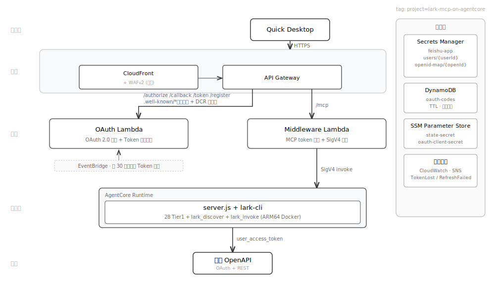
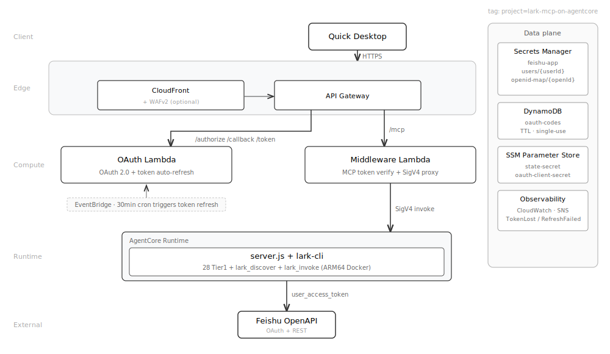

# lark-mcp-on-agentcore

[](LICENSE)
[](https://github.com/larksuite/cli)
[](https://aws.amazon.com/bedrock/agentcore/)

[中文](#lark-mcp-on-agentcore) | [English](#english)

**在 [lark-cli](https://github.com/larksuite/cli) 之上构建的托管远程 MCP 服务——让支持远程 MCP 的客户端（如 [Amazon Quick Desktop](https://aws.amazon.com/quick/desktop/)）能通过 200+ 工具调用飞书 2500+ API，并以正确的参数、顺序、前置条件完成多步操作。**

[lark-cli](https://github.com/larksuite/cli) 是飞书官方命令行工具，封装了 2500+ API 为 200+ 工具，并附带 23 个业务域 Skill 沉淀多步编排的最佳实践（参数格式、调用顺序、前置条件）。本项目由容器内的 lark-cli 执行所有 API 调用，继承其全部能力（其中 Skill 已适配为 MCP 形态，按需加载）。在此基础上，补齐 lark-cli 在团队场景下的不足：

- **业务用户零门槛。** 成员浏览器授权一次即用，无需本地安装或配置——非技术用户也能直接上手；每人以自己飞书身份调用，数据按用户隔离。
- **IT 集中管控。** 只创建一个飞书应用、管理员部署一次，全员共用。飞书应用与凭证集中管理，IT 可统一审计权限范围、应用可见性；token 服务端加密存储并自动刷新。

底座 AWS Bedrock AgentCore：空闲缩零、按量计费，内置可观测性。

## 一个复杂编排的例子

简单操作（查日程、发消息、建记录）AI 一步就能调对。真正体现价值的是**多步编排**——一句话背后有依赖、有顺序、有前置条件。比如：

> **「帮我明天下午约个产品评审会，邀请研发组，需要会议室，会后建个跟进待办」**

支持远程 MCP 的客户端连上本服务后，AI 会先通过 `lark_get_skill` 加载 calendar 与 task 两个 Skill，按其指引依次执行：

| # | AI 调用 | 为什么是这一步 |
|---|---------|---------------|
| 1 | `lark_contact_search_user("研发组")` | 把"研发组"解析成 open_id——发邀请前的前置条件 |
| 2 | `lark_calendar_freebusy(...)` | 查参会人忙闲，避开冲突 |
| 3 | `lark_calendar_suggestion(...)` | 时间模糊时先推荐候选时段，等用户确认 |
| 4 | `lark_calendar_room_find(slot=已确认)` | 仅对确定的时间块找会议室（Skill 强制：无明确时间不得直接找会议室） |
| 5 | `lark_calendar_create(...)` | 落地日程，带上参会人与会议室 |
| 6 | `lark_task_create("评审跟进", ...)` | 创建会后跟进待办 |

参数格式、调用顺序、"先查忙闲再订会议室"这类前置约束，都来自 lark-cli 官方 Skill——本项目改写为 MCP 形态后按需加载。所有操作以用户自己的飞书身份执行，数据按用户隔离。

→ 完整时序图与 23 个编排域清单见 [智能编排详解](docs/skills_zh.md)。

## 部署

```bash
bash <(curl -fsSL https://raw.githubusercontent.com/ddpie/lark-mcp-on-agentcore/main/scripts/install.sh)
```

检查依赖 → 飞书凭证 → 区域 / WAF / 日志保留 / 告警预设 / Webhook → 确认 → 自动部署

> 重复部署或升级版本时自动填入上次配置，按需修改。

## 架构

支持远程 MCP 的客户端（如 Quick Desktop）发起请求 → CloudFront → API Gateway → Middleware Lambda（验证 MCP Token + SigV4 签名）→ AgentCore Runtime（MCP 服务容器处理飞书 API 调用）。OAuth Lambda 负责用户授权和 Token 自动刷新（每 30 分钟），EventBridge 定时触发。所有 Token 加密存储在 Secrets Manager 中。

<p align="center">
  
</p>

<details>
<summary>组件一览</summary>

| 类别 | 组件 | 说明 |
|---|---|---|
| 计算 | AgentCore Runtime | MCP 服务容器，无状态，自动弹性，空闲缩零 |
| 计算 | Lambda × 3 | OAuth 流程 + MCP 代理 + 告警转发（告警转发 Lambda 仅在配置 webhook 时创建） |
| 边缘 | CloudFront | HTTPS 入口；可选 WAFv2 速率限制 |
| 可观测 | CloudWatch | Dashboard（5 板块 / 12 图表）+ 10 Alarms → SNS → 飞书群 |
| 状态 | SM + DDB + SSM | Token 加密存储 + Auth Code + 签名密钥 |

</details>

## 为什么不一样

| 差异化 | 说明 |
|---|---|
| **智能编排** | 把 lark-cli 官方 23 个业务域 Skill 改写为纯 MCP 形态、按需加载——让支持远程 MCP 的客户端也能在操作前读到这些最佳实践 |
| **业务用户零门槛、IT 集中管控** | 只创建一个飞书应用、管理员部署一次，全员共用——非技术成员浏览器授权一次即用；飞书应用集中管理，IT 可统一审计权限与可见性；每位用户以自己飞书身份调用，数据按用户隔离 |

<details>
<summary>运维 / 安全 / 成本特性</summary>

| 特性 | 说明 |
|---|---|
| **按需付费** | AgentCore Runtime 空闲缩零，按 vCPU-秒 + 内存-秒计费 |
| **渐进授权** | 默认只申请常用权限；首次用到某个低频功能时，自动生成 incremental-auth 链接，用户点击在飞书授权页确认即可，已有权限会累积 |
| **低运维** | Token 自动刷新（30min）、异常自动告警到飞书群、日志按策略过期 |
| **安全** | PKCE + HMAC token + WAF + Secrets Manager 加密存储（[详情](docs/security_zh.md)） |
| **轻量升级** | lark-cli 新版本发布时，按 `docs/skills/bump-lark-cli.md` 流程操作（提取 scope + 适配 skill + deploy），终端用户无需任何操作 |

</details>

## 工具列表

### Tier 1 高频工具（28 个，直接注册）

| 类别 | 工具 |
|------|------|
| IM (5) | 发消息、搜索消息、群列表、聊天记录、搜索群 |
| Calendar (4) | 日程概览、创建日程、查忙闲、找会议室 |
| Docs (4) | 创建、获取、搜索、编辑文档 |
| Base (4) | 获取表、查询数据、批量创建记录、搜索记录 |
| Drive (3) | 搜索、上传、下载文件 |
| Task (3) | 创建任务、我的任务、完成任务 |
| Contact (2) | 搜索用户、获取用户信息 |
| Sheets (2) | 读取、写入单元格 |
| Mail (1) | 发送邮件 |

### Meta Tools（4 个）

| 工具 | 读写 | 说明 |
|------|------|------|
| `lark_discover` | read | 按关键词或分类搜索其余所有 lark-cli 命令，返回名称 + 完整参数 schema |
| `lark_invoke` | read/write | 执行 discover 找到的工具（传入 tool_name + args） |
| `lark_list_skills` | read | 列出所有可用的 Skill，包含各业务域的多步操作最佳实践 |
| `lark_get_skill` | read | 获取某个业务域的完整 Skill（如日历预约流程、消息发送规范） |

高频操作直接调用即可；复杂编排（如"帮我约个会议"）先通过 `lark_get_skill` 获取操作指南，再按指南调用工具。

<details>
<summary>Tier 2 工具（200+，通过 discover/invoke 调用）</summary>

| 类别 | 代表功能 |
|------|----------|
| Base | 高级权限管理、复制表格、字段/表单/仪表盘 CRUD、记录导入导出 |
| Sheets | 追加行、批量样式、合并单元格、条件格式、数据验证 |
| Mail | 草稿管理、回复、转发、全部回复、模板、邮件规则 |
| Task | 指派、评论、关注者、提醒、子任务、清单管理 |
| Drive | 评论、权限申请、创建文件夹、移动/复制、导出 |
| IM | 创建群聊、更新群信息、消息回复、书签、下载附件 |
| OKR | 周期列表、目标详情、进展记录、上传图片 |
| VC | 会议搜索、入会/离会、纪要、录制、事件列表 |
| Wiki | 空间列表、节点创建/复制/移动、删除空间 |
| Docs | 媒体下载/插入/预览、批量操作 |
| Calendar | 回复邀请(RSVP)、智能时间建议、更新日程 |
| Markdown | 创建、获取、覆盖 Markdown 文件 |
| Minutes | 搜索妙记、下载音视频、上传生成妙记 |
| Slides | 创建演示文稿、上传图片、替换页面元素 |
| Whiteboard | 导出画板、更新画板内容 |

</details>

## 智能编排 (Skill)

lark-cli 官方 23 个业务域 Skill 沉淀了多步操作的最佳实践——参数格式、调用顺序、前置条件。但这些 Skill 原本依赖客户端 shell 执行 lark-cli + 读取本地 md 文件，支持远程 MCP 的客户端用不上。本项目把它们改写成纯 MCP 形态，通过 `lark_get_skill` 按需加载——例如"约个产品评审会"自动走 解析参会人→查忙闲→推荐时段→订会议室→建日程→创建待办。按需加载，不占用固定 context。

覆盖日历、IM、多维表格、邮件、文档、视频会议、任务、知识库、电子表格、OKR、妙记、画板…… 等 23 个业务域。

→ 详见 [智能编排详解（含时序图 + 23 域清单）](docs/skills_zh.md)

## 文档

| 主题 | 链接 |
|------|------|
| 智能编排（Skill） | [docs/skills_zh.md](docs/skills_zh.md) |
| Quick Desktop 配置（图文 6 步） | [docs/quick-desktop-setup_zh.md](docs/quick-desktop-setup_zh.md) |
| 安全设计 | [docs/security_zh.md](docs/security_zh.md) |
| 可观测性 & 告警 | [docs/observability_zh.md](docs/observability_zh.md) |
| 运维 & 命令 | [docs/operations_zh.md](docs/operations_zh.md) |
| 常见问题 | [docs/faq_zh.md](docs/faq_zh.md) |
| 成本估算 | [docs/cost_zh.md](docs/cost_zh.md) |
| 项目结构 | [docs/structure_zh.md](docs/structure_zh.md) |

## 快速命令

```bash
./scripts/deploy.sh          # 部署 / 更新
./scripts/ops.sh status      # 系统状态
./scripts/ops.sh list-users  # 已授权用户
./scripts/ops.sh logs        # Lambda 日志
./scripts/teardown.sh        # 销毁所有资源
```

## 风险提示

AI Agent 以用户身份调用飞书 API 存在模型幻觉、prompt injection 等固有风险。详见 [lark-cli 安全与风险提示](https://github.com/larksuite/cli/blob/main/README.zh.md#安全与风险提示使用前必读)。

## License

MIT

---

# English

**A hosted remote MCP service built on top of [lark-cli](https://github.com/larksuite/cli) — so remote MCP clients (e.g. [Amazon Quick Desktop](https://aws.amazon.com/quick/desktop/)) can call Feishu's 2500+ APIs via 200+ tools, and complete multi-step operations with the right parameters, order, and preconditions.**

[lark-cli](https://github.com/larksuite/cli) is Feishu's official command-line tool that wraps the 2500+ APIs into 200+ tools and ships 23 domain Skills capturing multi-step orchestration best practices (parameter formats, call order, preconditions). This project executes all API calls via lark-cli inside the container, inheriting its full capabilities (Skills included, adapted into MCP form and loaded on demand). On top of that, it fills the gaps lark-cli has as a team service:

- **Zero-friction for end users.** Members authorize once in the browser — no local install, no config, no technical skill required. Every call runs under each user's own Feishu identity, data isolated per user.
- **Centrally managed for IT.** One Feishu app, one admin deploy, shared by everyone. The Feishu app and its credentials are managed centrally, so IT can audit scopes and app visibility in one place; tokens are encrypted server-side and auto-refreshed.

Hosted on AWS Bedrock AgentCore: scales to zero when idle, pay-per-use, with built-in observability.

## A complex orchestration example

Simple operations (check the calendar, send a message, create a record) are one correct call away for an AI. The real value shows in **multi-step orchestration** — where one sentence hides dependencies, ordering, and preconditions. For example:

> **"Schedule a product review tomorrow afternoon, invite the dev team, book a room, and create a follow-up task afterward."**

Once a remote MCP client connects to this service, the AI first loads the calendar and task Skills via `lark_get_skill`, then executes in order following their guidance:

| # | AI call | Why this step |
|---|---------|---------------|
| 1 | `lark_contact_search_user("dev team")` | Resolve "dev team" to open_ids — a precondition for inviting them |
| 2 | `lark_calendar_freebusy(...)` | Check attendees' availability to avoid conflicts |
| 3 | `lark_calendar_suggestion(...)` | When the time is vague, propose candidate slots and wait for confirmation |
| 4 | `lark_calendar_room_find(slot=confirmed)` | Find a room only for a concrete time block (Skill rule: no room lookup without an explicit time) |
| 5 | `lark_calendar_create(...)` | Create the event with attendees and room |
| 6 | `lark_task_create("review follow-up", ...)` | Create the post-meeting follow-up task |

Parameter formats, call order, and preconditions like "check free/busy before booking a room" all come from lark-cli's official Skills — this project rewrites them into MCP form and loads them on demand. Every action runs under the user's own Feishu identity, data isolated per user.

→ Full sequence diagram and the list of 23 orchestration domains: [Smart Orchestration details](docs/skills_en.md).

## Deploy

```bash
bash <(curl -fsSL https://raw.githubusercontent.com/ddpie/lark-mcp-on-agentcore/main/scripts/install.sh)
```

Check deps → Feishu credentials → Region / WAF / Log retention / Alarm presets / Webhook → Confirm → Auto deploy

> Re-deploys and upgrades pre-fill previous config; change only what you need.

## Architecture

Requests from a remote MCP client (e.g., Quick Desktop) → CloudFront → API Gateway → Middleware Lambda (MCP token verification + SigV4 signing) → AgentCore Runtime (MCP service container handles Feishu API calls). OAuth Lambda manages user authorization and auto-refreshes tokens every 30 minutes via EventBridge. All tokens encrypted in Secrets Manager.

<p align="center">
  
</p>

<details>
<summary>Components</summary>

| Category | Component | Description |
|---|---|---|
| Compute | AgentCore Runtime | MCP service container, stateless, auto-scaling, scale-to-zero |
| Compute | Lambda × 3 | OAuth flow + MCP proxy + alarm relay (the alarm-relay Lambda is created only when a webhook is configured) |
| Edge | CloudFront | HTTPS entry; optional WAFv2 rate limiting |
| Observability | CloudWatch | Dashboard (5 sections / 12 charts) + 10 Alarms → SNS → Feishu group |
| State | SM + DDB + SSM | Encrypted tokens + Auth codes + Signing keys |

</details>

## Why it's different

| Differentiator | Description |
|---|---|
| **Smart orchestration** | lark-cli's official 23 domain Skills, rewritten into pure-MCP form and loaded on demand — so remote MCP clients can also read these best practices before acting |
| **Zero-friction for users, centrally managed for IT** | One Feishu app, one admin deploy, shared by everyone — non-technical members authorize once in the browser; the Feishu app is managed centrally, so IT can audit scopes and visibility in one place; each user acts under their own Feishu identity, data isolated per user |

<details>
<summary>Operational / security / cost features</summary>

| Feature | Description |
|---|---|
| **Pay-per-use** | AgentCore Runtime scales to zero when idle, billed by vCPU-seconds + memory-seconds |
| **Incremental auth** | Only common scopes are requested up front; the first time a low-frequency tool is used, an incremental-auth link is generated — the user clicks it, approves the new scope on the Feishu authorization page, and Feishu accumulates the existing scopes |
| **Low-ops** | Auto token refresh (30min), alarms auto-push to Feishu group, logs expire by policy |
| **Secure** | PKCE + HMAC tokens + WAF + Secrets Manager encryption ([details](docs/security_en.md)) |
| **Lightweight upgrade** | When lark-cli releases a new version, follow `docs/skills/bump-lark-cli.md` (extract scopes + adapt skills + deploy), end users need no action |

</details>

## Tool List

### Tier 1 — High-Frequency Tools (28, registered directly)

| Category | Tools |
|----------|-------|
| IM (5) | Send message, search messages, list groups, chat history, search groups |
| Calendar (4) | Agenda overview, create event, check availability, find meeting rooms |
| Docs (4) | Create, fetch, search, edit documents |
| Base (4) | Get table, query records, batch create records, search records |
| Drive (3) | Search, upload, download files |
| Task (3) | Create task, my tasks, complete task |
| Contact (2) | Search user, get user info |
| Sheets (2) | Read, write cells |
| Mail (1) | Send email |

### Meta Tools (4)

| Tool | R/W | Description |
|------|-----|-------------|
| `lark_discover` | read | Search all remaining lark-cli commands by keyword or category; returns name + full parameter schema |
| `lark_invoke` | read/write | Execute a tool found via discover (pass tool_name + args) |
| `lark_list_skills` | read | List all available Skills covering multi-step best practices per domain |
| `lark_get_skill` | read | Get the full Skill for a domain (e.g., calendar scheduling workflow, message sending rules) |

High-frequency tools are called directly; for complex orchestration (e.g., "schedule a meeting") the AI calls `lark_get_skill` first to get the workflow guide, then follows it.

<details>
<summary>Tier 2 — Extended Tools (200+, via discover/invoke)</summary>

| Category | Representative Features |
|----------|------------------------|
| Base | Advanced permissions, copy table, field/form/dashboard CRUD, record import/export |
| Sheets | Append rows, batch styles, merge cells, conditional formatting, data validation |
| Mail | Draft management, reply, forward, reply-all, templates, mail rules |
| Task | Assign, comment, followers, reminders, subtasks, tasklist management |
| Drive | Comments, permission requests, create folder, move/copy, export |
| IM | Create group, update group info, reply to messages, bookmarks, download attachments |
| OKR | Period list, objective details, progress records, upload images |
| VC | Meeting search, join/leave, minutes, recording, event list |
| Wiki | Space list, node create/copy/move, delete space |
| Docs | Media download/insert/preview, batch operations |
| Calendar | RSVP, smart time suggestions, update events |
| Markdown | Create, fetch, overwrite Markdown files |
| Minutes | Search minutes, download A/V, upload to generate minutes |
| Slides | Create presentation, upload images, replace page elements |
| Whiteboard | Export board, update board content |

</details>

## Smart Orchestration (Skill)

lark-cli's official 23 domain Skills capture multi-step best practices — parameter formats, call order, preconditions. But those Skills originally relied on the client shell-executing lark-cli and reading local md files, so remote MCP clients couldn't use them. This project rewrites them into pure-MCP form and loads them on demand via `lark_get_skill` — e.g., "schedule a product review" follows resolve attendees → check free/busy → suggest slots → book room → create event → create follow-up. Loaded on demand, no fixed context cost.

Spanning 23 domains: Calendar, IM, Bitable, Mail, Docs, VC, Task, Wiki, Sheets, OKR, Minutes, Whiteboard, and more.

→ See [Smart Orchestration details (sequence diagram + 23-domain list)](docs/skills_en.md)

## Docs

| Topic | Link |
|-------|------|
| Smart Orchestration (Skill) | [docs/skills_en.md](docs/skills_en.md) |
| Quick Desktop Setup (6 steps, screenshots) | [docs/quick-desktop-setup_en.md](docs/quick-desktop-setup_en.md) |
| Security | [docs/security_en.md](docs/security_en.md) |
| Observability & Alarms | [docs/observability_en.md](docs/observability_en.md) |
| Operations & Commands | [docs/operations_en.md](docs/operations_en.md) |
| FAQ | [docs/faq_en.md](docs/faq_en.md) |
| Cost | [docs/cost_en.md](docs/cost_en.md) |
| Project Structure | [docs/structure_en.md](docs/structure_en.md) |

## Quick Commands

```bash
./scripts/deploy.sh          # Deploy / update
./scripts/ops.sh status      # System status
./scripts/ops.sh list-users  # Authorized users
./scripts/ops.sh logs        # Lambda logs
./scripts/teardown.sh        # Destroy all resources
```

## Risk Notice

Having an AI Agent operate Feishu APIs as the user carries inherent risks such as model hallucination and prompt injection. See [lark-cli Security Warnings](https://github.com/larksuite/cli/blob/main/README.md#security--risk-warnings-read-before-use).

## License

MIT
