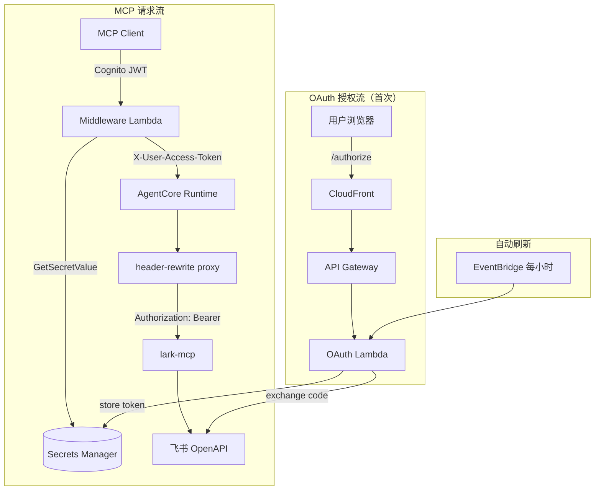

# lark-mcp-on-agentcore

[](LICENSE)
[](https://github.com/larksuite/lark-openapi-mcp)
[](https://aws.amazon.com/bedrock/agentcore/)

将飞书官方 [lark-openapi-mcp](https://github.com/larksuite/lark-openapi-mcp) 部署为企业级远程 MCP Server，基于 AWS Bedrock AgentCore，支持多用户、per-user 身份隔离。

让 [Amazon Quick Desktop](https://aws.amazon.com/quick/desktop/)、[Kiro](https://kiro.dev/)、Claude Desktop、Cursor 等 MCP 客户端以**用户自己的飞书身份**调用飞书 API——无需每个用户自己搭服务、管 token。

部署完成后，用户可以用自然语言让 AI 助手：

- 以自己的身份发消息、管理群聊
- 创建和查询自己的日程、预订会议室
- 读写有权限的多维表格记录
- 操作云文档、知识库
- 管理自己的审批、任务、邮件

### 示例对话

```
> 帮我查一下今天的日程
> 发一条消息给产品研发群：明天下午3点对齐需求
> 把上周的周报文档分享给张三
> 帮我在多维表格里新增一条 bug 记录
> 查看我待处理的审批
```

## 为什么用这个？

| | 本项目 | lark-openapi-mcp 本地部署 | [lark-cli-mcp-wrapper](https://github.com/ddpie/lark-cli-mcp-wrapper) |
|---|---|---|---|
| 部署方式 | 一行命令，企业统一部署 | 每个用户自己跑 | npx 本地运行 |
| 用户身份 | per-user 隔离（OAuth） | 单用户 | 单用户 |
| Token 管理 | 自动获取、刷新、加密存储 | 用户自己管 | 复用 lark-cli 登录态 |
| 多用户 | ✓ 1000+ 用户共享一个部署 | ✗ | ✗ |
| 安全 | Secrets Manager + IAM + HMAC | 本地 keychain | 本地 keychain |
| 企业 SSO | Cognito（支持 SAML 联邦） | — | — |
| 适用场景 | 企业内部统一部署 | 个人/开发调试 | 个人/小团队 |

## 快速部署

### 准备工作

1. **AWS 账号** — 需要有效凭证（`aws configure`）
2. **飞书自建应用** — 在 [飞书开放平台](https://open.feishu.cn) 创建：
   - 进入 [开发者后台](https://open.feishu.cn/app) → 创建企业自建应用
   - 应用能力 → 启用**机器人**
   - 权限管理 → 开通所需 API 权限（如 `im:chat`、`calendar:calendar`）
   - 记下 **App ID** 和 **App Secret**（安全设置页面）
   - 版本管理 → 创建版本并发布（权限变更需发版才生效）

> 如无开放平台权限，请联系组织管理员获取 App ID + App Secret。

### 安装

```bash
bash <(curl -fsSL https://raw.githubusercontent.com/ddpie/lark-mcp-on-agentcore/main/scripts/install.sh)
```

脚本自动检查并安装依赖（Node.js、Docker、AWS CLI、CDK），引导输入飞书凭证并完成部署。

### 手动安装

```bash
git clone https://github.com/ddpie/lark-mcp-on-agentcore.git
cd lark-mcp-on-agentcore
./scripts/deploy.sh
```

### 部署后

脚本输出 **Redirect URL**，将它添加到飞书应用的 安全设置 → 重定向 URL。完成。

## MCP 客户端配置

部署成功后，配置 MCP 客户端连接到输出的 **McpEndpoint**。

### Amazon Quick Desktop

Settings → Capabilities → MCP → **+ Add MCP**：

| 字段 | 值 |
|------|-----|
| Connection type | Remote |
| Name | Lark (Feishu) |
| URL | `<部署输出的 McpEndpoint>` |
| Auth | Bearer Token |
| Token | Cognito JWT（通过 Hosted UI 获取） |

> JWT 获取：访问部署输出的 **CognitoLoginUrl** 完成登录后获得。

### Kiro IDE

Settings → MCP Servers → **Add Server**：

| 字段 | 值 |
|------|-----|
| Type | Remote (Streamable HTTP) |
| Name | Lark |
| URL | `<McpEndpoint>` |
| Headers | `Authorization: Bearer <cognito_jwt>` |

### Kiro CLI

编辑 `~/.kiro/mcp.json`：

```json
{
  "mcpServers": {
    "lark": {
      "type": "remote",
      "url": "<McpEndpoint>",
      "headers": {
        "Authorization": "Bearer <cognito_jwt>"
      }
    }
  }
}
```

### Claude Desktop

编辑 `~/.claude/claude_desktop_config.json`：

```json
{
  "mcpServers": {
    "lark": {
      "url": "<McpEndpoint>",
      "headers": {
        "Authorization": "Bearer <cognito_jwt>"
      }
    }
  }
}
```

### Cursor

Settings → MCP → Add Server：

- Type: `Remote`
- URL: `<McpEndpoint>`
- Headers: `Authorization: Bearer <cognito_jwt>`

### 首次使用

用户首次调用飞书工具时会收到一个授权 URL：

```
User not authorized. Visit: https://xxx.cloudfront.net/authorize?user_id=<uid>
```

在浏览器打开，完成飞书 OAuth 授权（一次性）。之后所有操作自动使用用户身份。

## 运维

```bash
./scripts/ops.sh status                 # 系统概览
./scripts/ops.sh list-users             # 已授权用户列表
./scripts/ops.sh check-token <user_id>  # 查看 token 状态与过期时间
./scripts/ops.sh revoke <user_id>       # 撤销用户授权
./scripts/ops.sh refresh-all            # 手动触发全量 token 刷新
./scripts/ops.sh logs                   # 查看最近 Lambda 执行日志
```

### 监控

- **Token 刷新**：EventBridge 每小时触发，结果写入 Lambda CloudWatch 日志
- **日志位置**：CloudWatch → Log Groups → `/aws/lambda/lark-token-shim`
- **建议告警**：Lambda Error 率 > 0（使用 CloudWatch Alarm）

## 安全

| 层面 | 措施 |
|------|------|
| Token 存储 | Secrets Manager（KMS 加密，CloudTrail 审计每次访问） |
| Token 传输 | 仅 AWS 内网传输（TLS + SigV4），不经过公网 |
| OAuth 防 CSRF | HMAC-SHA256 签名 state（timing-safe 比较，5 分钟过期） |
| API 认证 | Cognito JWT（Middleware）+ IAM auth（内部端点） |
| 容器 | 无状态 per-request 处理，非 root 运行，版本锁定 |
| App Secret | 仅在 Secrets Manager 中，不出现在环境变量、命令行、日志 |
| 网络 | CloudFront 前置（仅暴露 /authorize 和 /callback） |

## 成本

按需付费，无固定月费。主要计费项：

| 组件 | 计费方式 |
|------|---------|
| AgentCore Runtime | 按 vCPU/内存按秒计费，无请求时不收费 |
| Secrets Manager | $0.40/密钥/月（每个用户一个密钥） |
| Lambda / API Gateway / CloudFront | 按请求量，有免费额度 |

成本随用户数和调用频率线性增长。详见各服务定价页。

## 架构



用户首次使用需完成一次飞书 OAuth 授权，之后全自动。Token 每小时刷新，30 天内无需再次操作。

## 升级

重新运行部署脚本即可升级（支持选择 lark-mcp 版本）：

```bash
./scripts/deploy.sh
```

> ⚠️ 大版本升级前建议先在测试环境验证兼容性。

## 销毁

```bash
cd infra && npx cdk destroy --all
```

AgentCore Runtime 需额外删除：

```bash
./scripts/ops.sh destroy
```

## FAQ

**Q: 用户 30 天没使用，token 过期了怎么办？**

A: 下次使用时会收到授权 URL，重新在浏览器中授权一次即可。

**Q: 部署失败了怎么办？**

A: 脚本支持重跑（幂等）。已创建的资源不会重复创建。如需彻底重来：`cd infra && npx cdk destroy --all` 后重新运行 deploy.sh。

**Q: 如何限制哪些用户可以使用？**

A: Cognito User Pool 默认关闭自助注册。只有管理员创建的用户或通过飞连 SAML 联邦的用户才能登录。

**Q: 飞书应用权限不够怎么办？**

A: 在飞书开放平台 → 权限管理中开通所需权限，然后**必须创建新版本并发布**才会生效。

**Q: 支持国际版 Lark 吗？**

A: 支持。部署时通过 `LARK_MCP_EXTRA_ARGS` 设置 `--domain https://open.larksuite.com`。

## 测试

```bash
./scripts/test-e2e.sh --runtime-arn <arn> --oauth-endpoint <url>
```

覆盖 9 项检查：OAuth redirect、HMAC 验证、Runtime MCP 协议、token 存储、EventBridge 状态。

## 项目结构

```
docker/            容器 (lark-mcp + header-rewrite proxy)
infra/             CDK 基础设施 (4 stacks)
lambda/
  token-refresh-shim/   OAuth + token 自动刷新
  mcp-middleware/       JWT → SM → AgentCore 桥接
scripts/
  install.sh            一键安装 + 部署
  deploy.sh             交互式部署向导
  test-e2e.sh           端到端测试
  ops.sh                运维工具
  mock-saml-idp.sh      SAML 本地测试
```

## License

MIT
