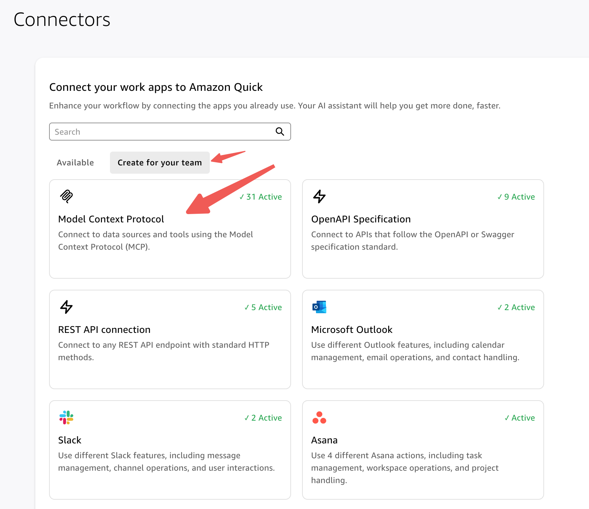
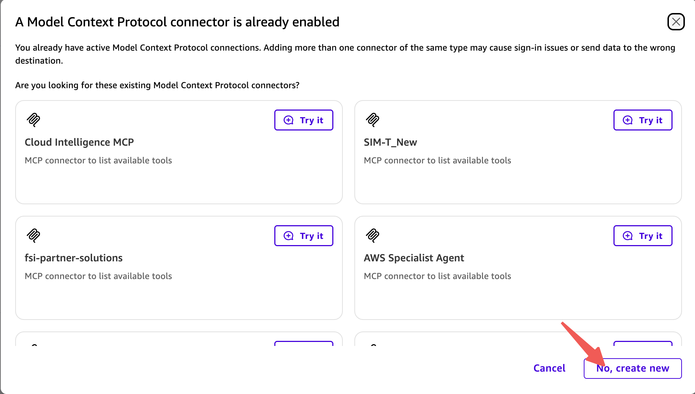
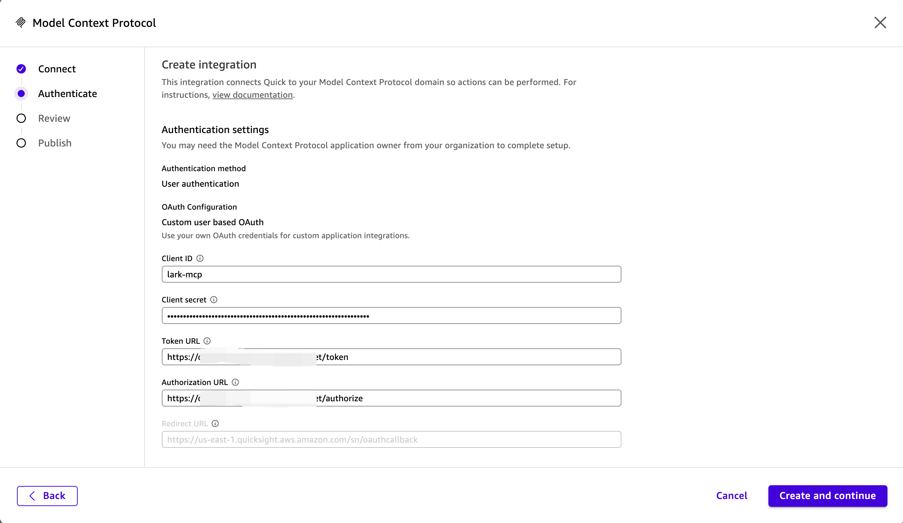
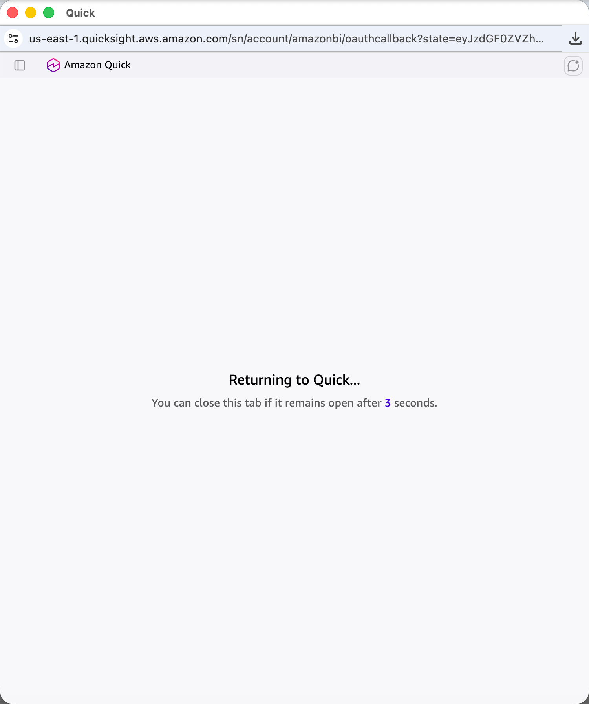
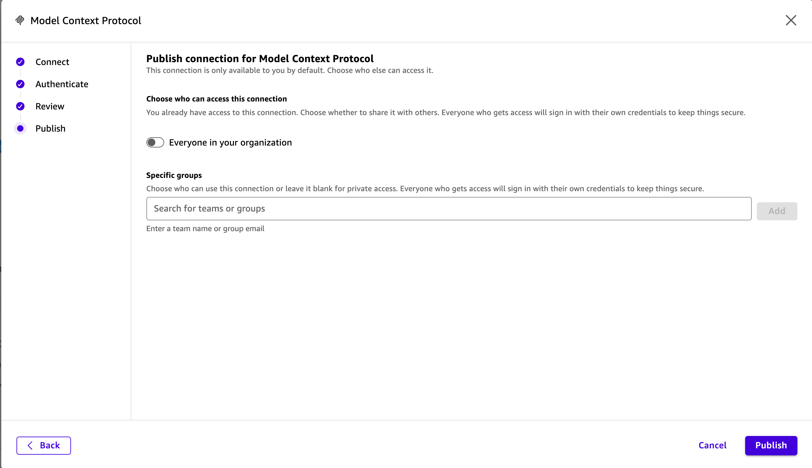
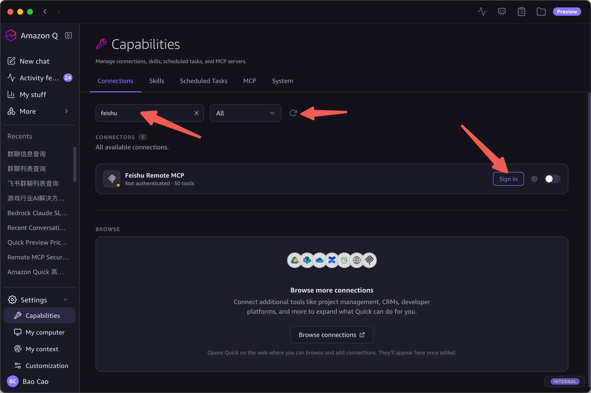

[中文](quick-desktop-setup_zh.md) | [English](quick-desktop-setup_en.md)

# Quick Desktop Setup

After deployment, add the Feishu MCP connection in Quick Desktop with the steps below.

## Step 1: Create Connector

In Quick Desktop click **Settings → Capabilities → Browse connections** (opens browser), choose **Create for your team** → **Model Context Protocol**:

<p align="center">
  
</p>

If prompted about an existing MCP connector, click **No, create new**:

<p align="center">
  
</p>

## Step 2: Connection Info

Fill in Name, Description, MCP server endpoint (from deploy output), Connection type **Public network**, click **Next**:

<p align="center">
  
</p>

## Step 3: OAuth Config

Fill in Client ID, Client Secret, Token URL, Authorization URL (all from deploy output), click **Create and continue**:

<p align="center">
  
</p>

## Step 4: Feishu Authorization

A Feishu authorization page automatically opens in the browser, click **Authorize**:

<p align="center">
  
</p>

After authorization, automatically returns to Quick:

<p align="center">
  
</p>

## Step 5: Publish

Choose visibility (default: only you; or "Everyone in your organization"), click **Publish**:

<p align="center">
  
</p>

After publishing, the Connector detail page shows all available tools:

<p align="center">
  
</p>

## Step 6: Use in Quick Desktop

Back in Quick Desktop, **Settings → Capabilities → Connections**, search "feishu", click **Sign in**:

<p align="center">
  
</p>

Once connected, Feishu tools are available in conversations.

## Result

Once connected, interact with Feishu through natural language in Quick Desktop:

<p align="center">
  
</p>

```
> Check my Feishu calendar for today
> Send a message to the product dev group: sync requirements tomorrow at 3pm
> Summarize last week's meeting notes into a doc
> Add a bug record to the Bitable
```

Every action runs under the user's own Feishu identity — data is isolated per user.
