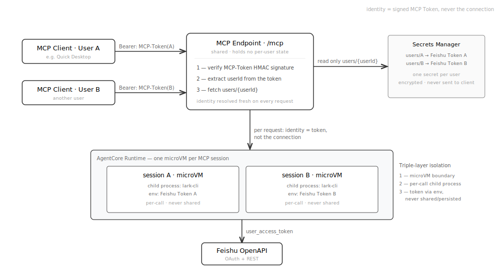
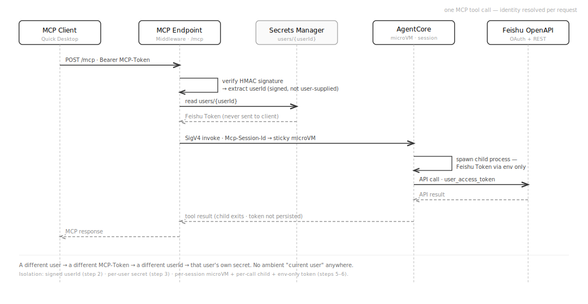
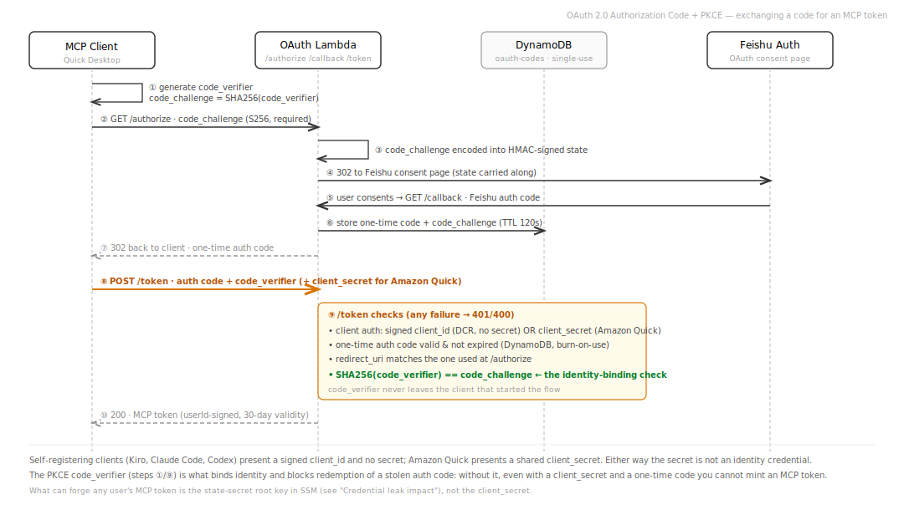

[中文](security_zh.md) | [English](security_en.md)

# Security

## Overview

The system employs defense-in-depth, implementing security controls at the network edge, transport layer, application layer, and storage layer. Tokens never leave the AWS internal network, OAuth uses PKCE + client_secret dual protection, and HMAC signing prevents CSRF and token forgery.

## User Isolation (Feishu Token · MCP Token · MCP Endpoint)

Identity in this service is **user-only**: every user acts as themselves, and one user can never read another user's data or act under their identity. That guarantee rests on a clean separation between three things people often conflate:

| | What it is | Who holds it | Lifetime |
|---|---|---|---|
| **MCP Token** | The Bearer token an MCP client (e.g. Quick Desktop) sends on every request. A signed envelope `base64url(userId:expiresAt:hmac)` — it **carries the identity** but is **not** a Feishu credential. | The MCP client, per connected user | 30 days |
| **Feishu Token** | The actual OAuth access/refresh token that calls Feishu's APIs. Never leaves AWS; never sent to the client. | Secrets Manager, one secret per user | Auto-refreshed every 30 min |
| **MCP Endpoint** | The single public URL (`/mcp`) all users share. It is **stateless w.r.t. identity** — it holds no per-user state; identity is resolved fresh from the MCP Token on every request. | Shared by everyone | — |

**The key idea:** the MCP Endpoint is shared, but identity is *not* tied to the connection or the endpoint — it is tied to the **MCP Token** the request carries. The endpoint takes that token, verifies its HMAC signature, extracts the `userId`, and looks up **that user's** Feishu Token in Secrets Manager. There is no ambient "current user" anywhere in the system.

<p align="center">
  
</p>

**Why a user can't cross over to another user:**

- **The userId is signed, not user-supplied.** It lives inside the HMAC-signed MCP Token (`tokenKey`); a client cannot change it without invalidating the signature. Tampering → signature mismatch → 401.
- **Feishu Tokens are stored per user** at `lark-mcp-on-agentcore/users/{userId}` and only ever read by `userId` extracted from a verified MCP Token. They are **never** sent back to the client.
- **Switching users (e.g. in Quick Desktop) is just a different MCP Token.** A new user completes OAuth and gets their own MCP Token → the endpoint resolves the new `userId` → reads the new user's Feishu Token. A user who hasn't authorized gets a 403 + re-auth link, never someone else's session.
- **Runtime isolation is triple-layered** (see `docs/agent/architecture.md`): each MCP session runs in its own AgentCore microVM; each tool call runs in its own child process; the Feishu Token is passed to that child via environment only, never shared between calls or persisted.
- **Confused-deputy guard:** the incremental-auth flow additionally verifies the consenting Feishu `open_id` belongs to the session owner, so user B cannot graft their Feishu authorization onto user A's session (see the incremental auth token note below).

The sequence below shows how identity is resolved — and the Feishu Token kept isolated — within a single MCP tool call:

<p align="center">
  
</p>

## OAuth 2.0 PKCE Flow

The system implements the full OAuth 2.0 Authorization Code + PKCE (RFC 7636) flow:

1. **Client generates a code_verifier** (random string) and **code_challenge** (SHA-256 hash)
2. The `/authorize` request must include `code_challenge` (returns 400 if missing); `code_challenge_method` is optional, but if provided it must be `S256` — any other value (e.g., `plain`) is rejected
3. The code_challenge is encoded into an HMAC-signed state parameter, carried through the Feishu authorization redirect
4. After Feishu authorization, `/callback` stores the auth code in DynamoDB (with code_challenge) and issues a one-time auth code to the client
5. The client's `/token` request must provide both `code_verifier` and `client_secret`
6. The server computes `SHA256(code_verifier)` and compares it to the stored code_challenge via base64url comparison

PKCE prevents authorization code interception attacks — even if an attacker captures the auth code, they cannot exchange it for tokens without the original code_verifier. Only S256 is accepted; plain method is rejected.

The sequence below shows a full authorization-and-exchange flow and the four checks at the `/token` endpoint — where **the PKCE `code_verifier` is the identity-binding check, while `client_secret` is just one defense-in-depth layer**:

<p align="center">
  
</p>

## Credential Leak Impact

The system involves several "secrets" with similar names but vastly different blast radii. The table below is ordered by the consequence of an **isolated leak**, to help triage priority during an incident:

| Credential | Where it lives | Consequence of an isolated leak | Severity | Remediation |
|---|---|---|---|---|
| **OAuth Client Secret** | SSM `oauth-client-secret` → OAuth Lambda env var; also a copy in client config | **Limited.** A static value shared by all clients, it is one of the four checks at `/token` but does **not** bind identity. Without the victim's one-time auth code and PKCE `code_verifier` from that flow, an attacker still cannot mint anyone's MCP token, let alone reach Feishu data. The main impact is weakening one defense-in-depth layer (if an auth code also leaks, only PKCE remains). | Low | `./scripts/ops.sh rotate-secret`; afterwards all MCP clients must update their Client Secret config. Issued MCP tokens are unaffected |
| **A user's MCP Token** | That user's MCP client | **Scoped to one user.** The holder can call MCP as that user within the 30-day validity. Cannot cross over to other users (identity is resolved per request from the signed `userId`), and cannot export the Feishu token (never handed out). | Medium | `./scripts/ops.sh revoke <userId>`; or rotate `state-secret` to invalidate all tokens |
| **Feishu App Secret** | Secrets Manager; fetched asynchronously after container start | **Application-wide.** With the App ID, it can act as the entire Feishu custom app, affecting every user's OAuth and API calls. | High | Reset the App Secret on the Feishu Open Platform, update Secrets Manager, redeploy |
| **STATE_SECRET root key** | SSM `state-secret` (SecureString) | **Catastrophic.** It derives all signing keys for MCP tokens / OAuth state / incremental-auth tokens; a leak lets an attacker **forge any user's MCP token** and thus act as any user. | Critical | Rotate `/lark-mcp-on-agentcore/state-secret` immediately; all users must reconnect (all issued tokens invalidate at once) |

**In one line:** What truly lets an attacker "act as someone else" is the **STATE_SECRET root key** (token forgery) and the **Feishu App Secret** (application-wide); an **isolated Client Secret leak has limited impact** — it is a config secret, not an identity credential. Regardless of severity, rotate the affected secret as soon as a leak is discovered.

## HMAC Token Signing (Domain-Separated Keys)

Three independent HMAC-SHA256 signing keys are derived from a single root secret (stored in SSM Parameter Store as SecureString):

```
STATE_SECRET (root, 256-bit)
  ├── HMAC(root, "oauth-state-v1")   → stateKey  (OAuth state signing)
  ├── HMAC(root, "mcp-token-v1")     → tokenKey  (MCP Bearer Token signing)
  └── HMAC(root, "mcp-incr-auth-v1") → incrKey   (Incremental auth token signing)
```

**Why domain separation?** If all three token types shared the same key, a signature for one type could potentially be used to forge another type (oracle attack). Domain separation ensures that observing state signatures reveals nothing about the MCP token signing key.

**OAuth State format:** `base64url(payload).timestamp.hmac_hex`
- payload encodes redirect_uri, client state, code_challenge, etc.
- timestamp enables 5-minute expiry check
- Verification uses `timingSafeEqual` to prevent timing attacks

**MCP Token format:** `base64url(userId:expiresAt:hmac_hex)`
- 30-day validity
- Middleware verifies signature and expiry on every request
- Failures are logged with specific reasons (expired / signature_mismatch / malformed_payload / decode_error)

**Incremental auth token:** Securely carries user ID to the `/authorize` endpoint for incremental authorization. Exposing raw user_id in URLs would enable confused-deputy attacks (attacker tricks victim into authorizing under an attacker-chosen ID), so the incremental auth token uses a separate key and is valid for only 5 minutes.

## Write-Probe Mechanism (Preflight Before Consuming refresh_token)

Feishu's refresh_token is **single-use** — once consumed, a new refresh_token is returned in the response. If the refresh succeeds but storage fails, the user's token is permanently lost.

To prevent this catastrophic scenario, the system performs a "write-probe" (preflight) before each refresh:

```
1. Read current secret value
2. Write the same value back (PutSecretValue, idempotent)
3. If write succeeds → SM is writable, proceed with refresh
4. If write fails → SM is not writable (throttled/network issue), skip this cycle
```

When skipped, the refresh_token is not consumed. It remains valid for the next 30-minute cycle when SM recovers. Only after the write-probe passes does the system call the Feishu refresh API.

If refresh succeeds but subsequent storage still fails (extreme edge case), the system retries with exponential backoff up to 5 times. If all 5 attempts fail, a CRITICAL-level log `store_token_lost` is emitted, triggering the highest-priority alarm.

## WAF Rules

WAFv2 deploys to us-east-1 (CloudFront scope), optionally enabled (interactive prompt during deploy, default off):

| Rule | Priority | Limit | Purpose |
|------|----------|-------|---------|
| rate-limit-authorize | 1 | 100 requests/5min/IP | Prevent brute-force on `/authorize` (OAuth initiation endpoint) |
| rate-limit-global | 2 | 2000 requests/5min/IP | Prevent bot crawling and flood attacks across all endpoints |

Both rules use IP aggregation and return 403 Block when exceeded. WAF enables CloudWatch metrics and request sampling for visibility into blocked requests.

When WAF is disabled, no charges are incurred. If WAF was previously enabled and you disable it on redeploy, deploy.sh automatically destroys the WAF stack in us-east-1.

## AWS Security Agent Domain Verification (optional)

To run [AWS Security Agent](https://docs.aws.amazon.com/securityagent/) penetration tests against the deployment, AWS requires HTTP-route proof of domain ownership. When you supply verification token(s) at deploy time (`deploy.sh` prompt, or `DOMAIN_VERIFICATION_TOKENS=` env var; comma- or space-separated for multiple agent spaces), the OAuth Lambda serves them at:

```
GET /.well-known/aws/securityagent-domain-verification.json  →  {"tokens":["<token>", ...]}
```

Properties:

- **Unauthenticated GET by design** — domain-ownership verification must be reachable without auth. The route returns only the operator-configured public token(s); it reads no secrets, takes no request input, and performs no I/O.
- **Inert by default** — when no token is configured the route returns 404, so it adds no surface for deployments that don't use Security Agent.
- Served as `application/json` with `Cache-Control: no-store`; covered by the same CloudFront + WAF path as every other route.
- **Removable** — this endpoint exists solely for Security Agent verification. Once verification is complete (or if you don't use Security Agent), clear the token on redeploy to disable it; the route + config can be removed entirely if the feature is no longer needed.

## Webhook Signature Verification

Alarm webhook pushes to Feishu group bots support two security verification methods:

**Signature verification (HMAC-SHA256):**
```
timestamp = Math.floor(Date.now() / 1000)
stringToSign = "${timestamp}\n${secret}"
sign = HMAC-SHA256(stringToSign, "").digest("base64")
```
The `timestamp` and `sign` fields are appended to the message JSON. Feishu's server validates the signature using the same algorithm, rejecting forged requests.

**Keyword verification:** The message title includes the configured keyword in `[keyword]` format. Feishu checks that message content contains the keyword and rejects messages that do not.

Both methods can be used simultaneously, configured via interactive prompts during deploy, and saved in `.local/deploy-config`.

## Token Refresh Interval (30 Minutes)

EventBridge triggers the token refresh Lambda every 30 minutes. The reasons for this interval:

1. **Feishu access_token TTL is 2 hours** — a 30-minute interval means tokens refresh when less than half their TTL remains, ensuring users always have a valid access_token
2. **Refresh condition:** `remaining < totalTtl / 2` — only refreshes when remaining validity is less than half the total TTL, avoiding unnecessary refresh_token consumption
3. **Concurrency control:** Maximum 5 users refresh in parallel (`CONCURRENCY = 5`), preventing Feishu API rate limiting from mass concurrent refreshes
4. **Cost consideration:** One Lambda invocation every 30 minutes costs negligible amounts (~43,200 invocations/month, well within free tier)

## Security Layer Summary

| Layer | Measure |
|-------|---------|
| Token storage | Secrets Manager (encrypted with the AWS-managed `aws/secretsmanager` KMS key by default; customer-managed KMS / BYOK is not currently supported; all reads/writes audited via CloudTrail) |
| Token transport | AWS internal TLS + SigV4, never traverses public internet |
| OAuth CSRF | HMAC-SHA256 signed state (timing-safe, 5-min expiry) |
| MCP auth | OAuth 2.0 (PKCE + client_secret), HMAC signed token (30-day validity) |
| Container | Stateless per-request, non-root; SIGTERM graceful shutdown with child-process tracking |
| App Secret | Container kicks off the Secrets Manager fetch at startup asynchronously; until it loads, `/ping` returns 503 and `tools/call` returns `server_initializing`, so traffic is gated; the secret never enters the AgentCore control plane, logs, or argv |
| Edge protection | CloudFront; optional WAFv2 (interactive prompt during deploy, default off) |
| OAuth code | DynamoDB with TTL + ConditionExpression (replay protection) |
| Token refresh | SM write-probe before calling Feishu; on probe failure, refresh_token is NOT consumed |
| High-risk writes | Require `_confirm: true`; otherwise return `confirmation_required` |
| Deploy surface | Sensitive values passed via file-based AWS CLI inputs (`--environment file://`, `--secret-string file://`) so they do not appear in `ps auxww` |
| Redirect URI validation | Hostname-based comparison (not regex), prevents x.foo.com.attacker.com bypass |
| Log sanitization | userId / open_id appear as sha256 first-16 hex chars, never in plaintext |
