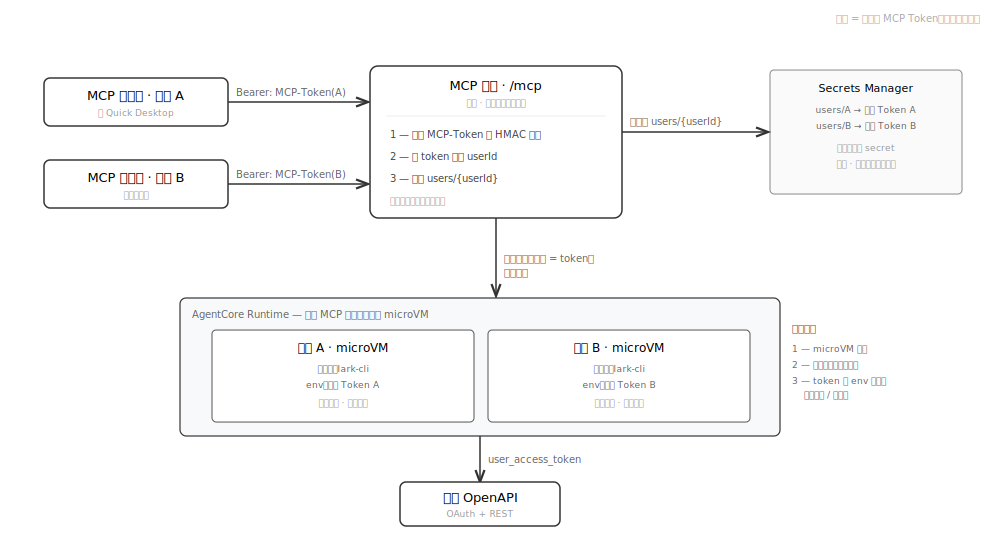
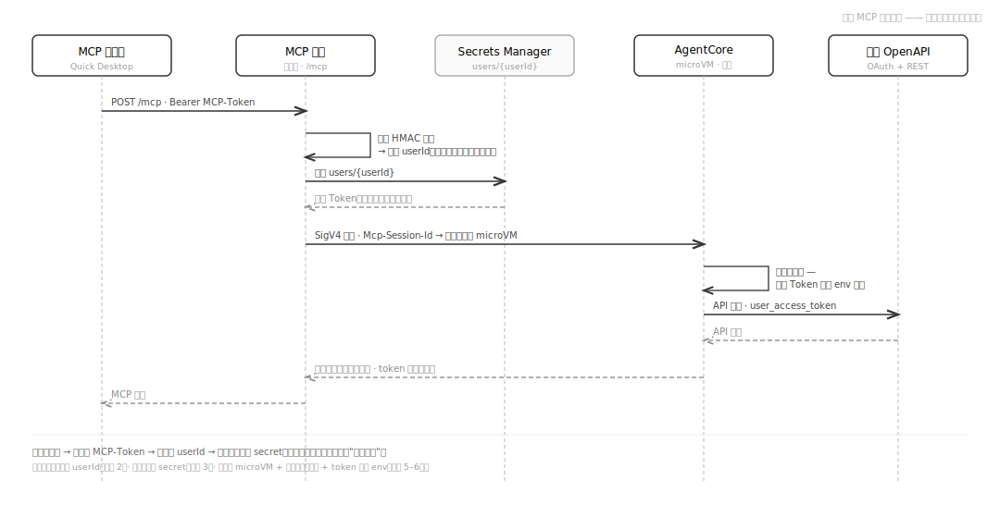
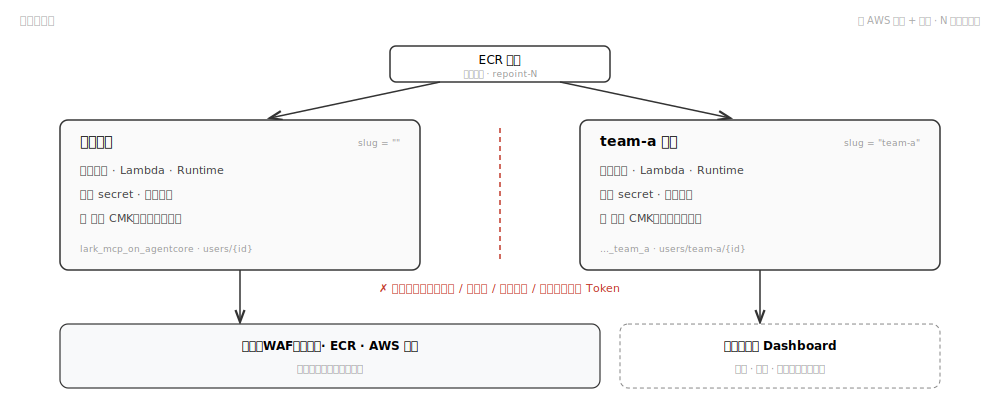
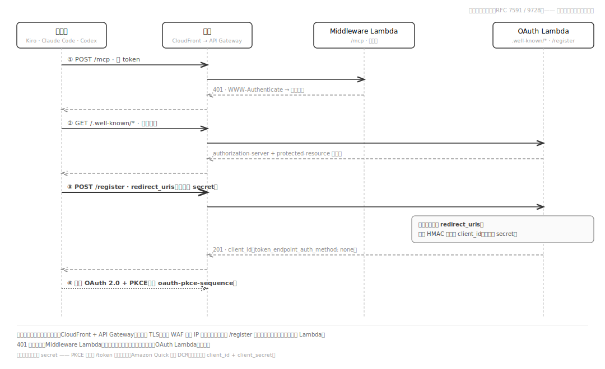
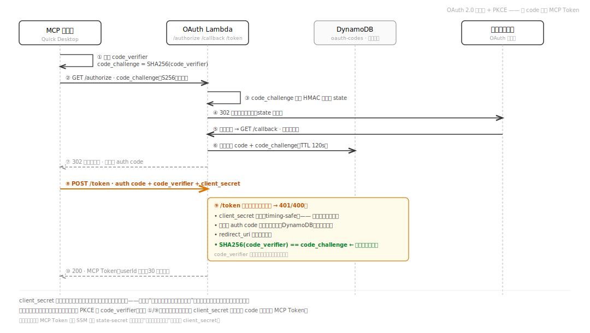

[中文](security_zh.md) | [English](security_en.md)

# 安全

## 概述

本系统采用纵深防御策略，在网络边缘、传输层、应用层和存储层都实施安全控制。所有 Token 永远不会离开 AWS 内网，OAuth 流程使用 PKCE（Amazon Quick 另加共享 client_secret），并通过 HMAC 签名防止 CSRF 和 Token 伪造。

## 用户隔离（飞书 Token · MCP Token · MCP 端点）

本服务的身份模型是**仅用户身份**：每个用户都以自己的身份行事，任何用户都无法读取他人数据或冒用他人身份。这一保证建立在对三个易被混淆的概念的清晰区分之上：

| | 是什么 | 由谁持有 | 有效期 |
|---|---|---|---|
| **MCP Token** | MCP 客户端（如 Quick Desktop）每次请求携带的 Bearer token。一个签名信封 `base64url(userId:expiresAt:hmac)`——它**承载身份**，但**不是**飞书凭据。 | MCP 客户端，每个已连接用户各一份 | 30 天 |
| **飞书 Token** | 真正调用飞书 API 的 OAuth access/refresh token。永不离开 AWS，永不下发给客户端。 | Secrets Manager，每用户一个 secret | 每 30 分钟自动刷新 |
| **MCP 端点** | 所有用户共用的唯一公开 URL（`/mcp`）。它对身份是**无状态的**——不保存任何用户态，每次请求都从 MCP Token 重新解析身份。 | 全体共用 | — |

**核心思想：** MCP 端点是共享的，但身份**并不**绑定在连接或端点上——身份绑定在请求携带的 **MCP Token** 上。端点拿到该 token，校验其 HMAC 签名，取出 `userId`，再去 Secrets Manager 查**这个用户的**飞书 Token。系统中不存在任何隐式的"当前用户"。

<p align="center">
  
</p>

**为什么一个用户无法越界到另一个用户：**

- **userId 是签名的，不是用户提交的。** 它存在于 HMAC 签名的 MCP Token 内（`tokenKey`）；客户端无法在不破坏签名的情况下篡改它。篡改 → 签名不匹配 → 401。
- **飞书 Token 按用户分别存储**于 `lark-mcp-on-agentcore/users/{userId}`，且只会按"从已验证 MCP Token 中取出的 `userId`"读取，**绝不**回传给客户端。
- **切换用户（如在 Quick Desktop 中）只是换了一个 MCP Token。** 新用户完成 OAuth 后拿到自己的 MCP Token → 端点解析出新的 `userId` → 读取新用户的飞书 Token。未授权的用户会收到 403 + 重新授权链接，绝不会拿到他人的会话。
- **运行时隔离为三层**（见 `docs/agent/architecture.md`）：每个 MCP 会话运行在**独占的 AgentCore microVM** 中，会话间无共享内存或磁盘，因此一个用户的会话无法观察到另一个会话的运行中状态；每次工具调用运行在独立子进程中；飞书 Token 仅通过环境变量传给该子进程，绝不在调用间共享或持久化。
- **混淆代理（confused-deputy）防护：** 增量授权流程额外校验同意授权的飞书 `open_id` 确属会话所有者，因此用户 B 无法把自己的飞书授权嫁接到用户 A 的会话上（详见下文增量授权 Token 说明）。

下面的时序图展示在一次 MCP 工具调用中，身份如何被解析、飞书 Token 如何保持隔离：

<p align="center">
  
</p>

## 多应用隔离（单 AWS 账户、多个飞书应用）

单个 AWS 账户/区域可托管 **N 个相互独立的飞书应用**，每个应用以一个简短的 **slug** 部署（`./scripts/deploy.sh --app <slug>`）。保留的**默认**应用（空 slug）维持与原单应用部署字节一致的资源名。每个应用的物理名由两个必须保持一致的解析器从 slug 推导：`scripts/lib/slug.sh`（shell）与 `infra/lib/slug-names.ts`（CDK）。

<p align="center">
  
</p>

安全目标：**应用 A 永远无法读取、删除或伪造应用 B 的用户 Token。** 这建立在四道相互独立的边界上——纵深防御，去掉任意一道都不会单独打开漏洞：

| 边界 | 机制 | 阻止什么 |
|---|---|---|
| **凭据读取** | 每个应用的飞书 App Secret 存在 `feishu-app/<slug>`（斜杠分隔），运行时 IAM 角色精确限定到该 ARN。默认应用的 `feishu-app-*` 通配符无法匹配带斜杠的 `feishu-app/<slug>-…`。 | A 的运行时读取 B 的主凭据。 |
| **Token 伪造** | 每个应用有自己的 SSM `state-secret` 签名根（按 slug 区分）。为 A 签发的 MCP Token 在 B 下 HMAC 校验失败。 | 一个应用签发的 Token 被重放到另一个应用。 |
| **Token 删除 / 枚举** | `listAllUserSecrets` 施加两段筛选——尾斜杠前缀过滤 **加** 单段 `^<prefix>/[^/]+$` 匹配——使默认应用的 30 分钟刷新循环（会自动删除已撤权用户）永远看不到其它应用的嵌套 `users/<slug>/<openid>`。`ops.sh revoke` 也拒绝任何含 `/` 的 `user_id`。 | 默认应用的清理循环销毁某个 slug 应用的有效 Token。 |
| **IAM 资源边界** | 由于 IAM `*` 会匹配 `/`，默认应用的 `users/*` 授权本会覆盖所有 slug 的 `users/<slug>/<openid>`。一条显式的 **Deny `users/*/*`**（仅默认应用）堵住此口——单靠运行时筛选不够。 | 默认应用的 Lambda 对嵌套 secret 拥有 IAM 权限。 |

**KMS 是第五道、密码学层面的边界。** 每个应用拥有自己的客户自管 KMS 密钥（见下文）；兄弟应用的 Lambda 角色绝不出现在该密钥的 key policy 上，因此即便某道 IAM 边界被绕过，错误应用拿到的也是无法解密的密文。

**slug 不可变，只有别名可变。** 人类可读的**别名**在账户/区域内硬唯一，在任何资源创建*之前*通过原子注册表写入声明，因此两个应用绝不会撞同一显示名。重命名只改别名（`ops.sh rename`）；命名真实资源的 slug 永不改变——改它会使 RETAIN 的 `openid-map` 表成为孤儿并迫使所有用户重新授权。

## OAuth 2.0 PKCE 流程

系统实现了完整的 OAuth 2.0 Authorization Code + PKCE (RFC 7636) 流程：

1. **客户端生成 code_verifier**（随机字符串）和 **code_challenge**（SHA-256 哈希）
2. 客户端发起 `/authorize` 请求时必须携带 `code_challenge`（缺失则返回 400）；`code_challenge_method` 可省略，但若提供则必须为 `S256`，其他值（如 `plain`）会被拒绝
3. code_challenge 被编码进 HMAC 签名的 state 参数，随用户重定向到飞书授权页
4. 飞书授权后回调 `/callback`，系统将授权码存入 DynamoDB（含 code_challenge），生成一次性 auth code 返回客户端
5. 客户端请求 `/token` 时必须始终提供 `code_verifier`；是否还需提供 `client_secret`，取决于它的注册方式（见下文「两类客户端」）
6. 服务端计算 `SHA256(code_verifier)` 并与存储的 code_challenge 做 base64url 比对

PKCE 防止授权码被中间人截获后直接兑换 Token — 即使攻击者拿到了授权码，没有原始 code_verifier 也无法获取 access_token。系统只接受 S256 方法，拒绝 plain 方法。

### 两类客户端

同一端点同时服务两类 MCP 客户端，`/token` 通过 `client_id` 区分：

- **自助注册客户端（Kiro、Claude Code、Codex）** 通过发现机制（RFC 9728 Protected Resource Metadata，在 401 的 `WWW-Authenticate` 中通告）找到服务，并经 **`POST /register`**（RFC 7591 动态客户端注册）自助注册。它们拿到一个不透明、HMAC 签名的 `client_id`，**没有 secret**（`token_endpoint_auth_method: "none"`）。对这类 public client，**PKCE 是唯一的客户端认证**——`/token` 会拒绝携带 `client_secret` 的请求；注册时只接受 host 精确命中白名单（`ALLOWED_DOMAINS`、`localhost`/`127.0.0.1` 或 QuickSight host）的 `redirect_uris`。
- **Amazon Quick（Quick Desktop）** 使用部署时打印的共享 `OAUTH_CLIENT_ID` + `OAUTH_CLIENT_SECRET` 配置。它的 `/token` 请求在 PKCE 之外**额外**提供该 secret（用时间安全比较校验）。

无论哪类，**绑定身份的关键都是 PKCE 的 `code_verifier`**。对自助注册的 public client，它是唯一的客户端凭据；对 Amazon Quick，共享 `client_secret` 只是一层不绑定身份的额外纵深防御。

自助注册的客户端会先发现服务、再自助注册（Amazon Quick 跳过此步，直接用预置凭据）：

<p align="center">
  
</p>

下面的时序图再展示一次完整的授权与兑换流程，并标出 `/token` 端点的校验：

<p align="center">
  
</p>

## 凭据泄露影响对比

本系统涉及多种「密钥」，名字相近但爆炸半径相差极大。下表按**单独泄露**的后果排序，便于在应急时快速判断优先级：

| 凭据 | 存放位置 | 单独泄露的后果 | 严重性 | 处置 |
|---|---|---|---|---|
| **OAuth Client Secret** | SSM `oauth-client-secret` → OAuth Lambda 环境变量；Amazon Quick 配置中也有一份 | **有限。** 它只被 Amazon Quick（Quick Desktop）使用，自助注册的 public client 从不使用它；是 `/token` 兑换的一道校验，但**不绑定身份**。攻击者没有受害者本次流程的一次性 auth code 与 PKCE `code_verifier`，仍换不出任何人的 MCP Token，更拿不到飞书数据。主要影响是削弱 Amazon Quick 的一层纵深防御（配合 auth code 泄露时，防线只剩 PKCE）。 | 低 | `./scripts/ops.sh rotate-secret`；之后 Amazon Quick connector 需更新 Client Secret。自助注册客户端与已发放的 MCP Token 不受影响 |
| **某用户的 MCP Token** | 该用户的 MCP 客户端 | **限于单个用户。** 持有者可在 30 天有效期内以该用户身份调用 MCP。无法越权到其他用户（每次请求按签名内的 `userId` 解析），也无法导出飞书 Token（绝不下发）。 | 中 | `./scripts/ops.sh revoke <userId>`；或轮换 `state-secret` 使全部 Token 失效 |
| **飞书 App Secret** | Secrets Manager；容器启动后异步拉取 | **应用级。** 配合 App ID 可代表整个飞书自建应用行事，影响所有用户的 OAuth 与 API 调用。 | 高 | 在飞书开放平台重置 App Secret，更新 Secrets Manager，重新部署 |
| **STATE_SECRET 根密钥** | SSM `state-secret`（SecureString） | **灾难性。** 它派生出全部四个签名密钥（MCP Token / OAuth state / 增量授权 Token / DCR `client_id`），泄露后可**伪造任意用户的 MCP Token**，从而以任意用户身份调用。 | 严重 | 立即轮换 `/lark-mcp-on-agentcore/state-secret`；所有用户须重新连接、自助注册客户端须重新注册（所有已发放 Token 与 `client_id` 同时失效） |

**一句话总结：** 真正能让攻击者「以他人身份行事」的是 **STATE_SECRET 根密钥**（伪造 Token）和**飞书 App Secret**（应用级），而 **Client Secret 单独泄露危害有限**——它是配置秘密而非身份凭据。无论严重性高低，发现泄露都应尽快轮换对应密钥。

## HMAC Token 签名（域分离密钥）

系统从一个根密钥（存储在 SSM Parameter Store SecureString 中）派生出四个独立的 HMAC-SHA256 签名密钥：

```
STATE_SECRET (root, 256-bit)
  ├── HMAC(root, "oauth-state-v1")    → stateKey   (OAuth state 签名)
  ├── HMAC(root, "mcp-token-v1")      → tokenKey   (MCP Bearer Token 签名)
  ├── HMAC(root, "mcp-incr-auth-v1")  → incrKey    (增量授权 Token 签名)
  └── HMAC(root, "mcp-dcr-client-v1") → dcrKey     (DCR client_id 签名，RFC 7591)
```

**为什么域分离？** 如果各类 Token 共用同一密钥，则对某种 Token 的签名可能被用于伪造另一种（oracle 攻击）。域分离确保即使攻击者观察到某一签名的输出，也无法推导出另一签名密钥——例如一个 MCP Token 永远无法被当作已注册的 `client_id` 重放。DCR `client_id` 的 HMAC 输入还额外加 `dcr:` 前缀作为第二重隔离。

**OAuth State 签名格式：** `base64url(payload).timestamp.hmac_hex`
- payload 编码了 redirect_uri、client state、code_challenge 等
- timestamp 用于 5 分钟过期检查
- 验证时使用 `timingSafeEqual` 防止时序攻击

**MCP Token 签名格式：** `base64url(userId:expiresAt:hmac_hex)`
- 30 天有效期
- Middleware 每次请求都验证签名和过期时间
- 验证失败时区分具体原因并记录日志（expired / signature_mismatch / malformed_payload / decode_error）

**增量授权 Token：** 用于安全地将用户 ID 传递给 `/authorize` 端点的增量授权流程。直接在 URL 中暴露 user_id 会导致 confused-deputy 攻击（攻击者诱骗受害者在攻击者选择的 ID 下授权），因此增量授权 Token 使用独立密钥签名，有效期仅 5 分钟。

## Write-Probe 机制（Token 刷新前预检）

飞书的 refresh_token 是**一次性**的 — 使用后即失效，新的 refresh_token 在响应中返回。这意味着如果刷新成功但存储失败，用户的 Token 将永久丢失。

为防止这种灾难性场景，系统在每次刷新前执行"写探针"（preflight write-probe）：

```
1. 读取当前 Secret 值
2. 将相同值写回（PutSecretValue，幂等操作）
3. 如果写入成功 → SM 可写，继续刷新
4. 如果写入失败 → SM 不可写（限流/网络故障等），跳过本轮刷新
```

跳过刷新时，refresh_token 不会被消耗，下一个 30 分钟周期 SM 恢复后可以正常刷新。只有在 write-probe 通过后才会调用飞书 refresh API。

如果刷新成功但后续存储仍然失败（极端情况），系统会以指数退避重试最多 5 次。5 次全部失败则记录 CRITICAL 级别日志 `store_token_lost`，触发最高优先级告警。

## WAF 规则

WAFv2 部署在 us-east-1（CloudFront scope），可选启用（部署时交互询问，默认关闭）：

| 规则 | 优先级 | 限制 | 作用 |
|------|--------|------|------|
| rate-limit-authorize | 1 | 100 请求/5分钟/IP | 防止对 `/authorize` 的暴力攻击（OAuth 发起端点） |
| rate-limit-global | 2 | 2000 请求/5分钟/IP | 防止 bot 爬取和泛洪攻击整个站点 |

两个规则都使用 IP 聚合，超限后返回 403 Block。WAF 启用 CloudWatch 指标和请求采样，可在 AWS 控制台查看被拦截的请求详情。

禁用 WAF 时不会产生任何费用。如果之前启用了 WAF，重新部署时选择禁用，deploy.sh 会自动销毁 us-east-1 的 WAF stack。

## AWS Security Agent 域名验证（可选）

要用 [AWS Security Agent](https://docs.aws.amazon.com/securityagent/) 对本部署做渗透测试，AWS 要求通过 HTTP route 方式证明域名所有权。当你在部署时提供验证 Token（`deploy.sh` 交互提示，或 `DOMAIN_VERIFICATION_TOKENS=` 环境变量；多个 agent space 用逗号或空格分隔），OAuth Lambda 会在以下路径返回:

```
GET /.well-known/aws/securityagent-domain-verification.json  →  {"tokens":["<token>", ...]}
```

特性:

- **设计上免鉴权 GET** —— 域名所有权验证天然必须免鉴权可达。该路由只返回部署者配置的公开 Token,不读取任何密钥、不接收请求输入、不发起任何 I/O。
- **默认惰性** —— 未配置 Token 时返回 404,因此对不使用 Security Agent 的部署不增加任何攻击面。
- 以 `application/json` + `Cache-Control: no-store` 返回;与其它路由共享同一套 CloudFront + WAF 路径。
- **可移除** —— 此端点仅为 Security Agent 验证而存在。验证完成后(或不使用 Security Agent 时),重新部署时清除 Token 即可禁用;若不再需要该功能,可整体移除路由与配置。

## Webhook 签名验证

告警 Webhook 推送到飞书群机器人时支持两种安全验证：

**签名验证（HMAC-SHA256）：**
```
timestamp = Math.floor(Date.now() / 1000)
stringToSign = "${timestamp}\n${secret}"
sign = HMAC-SHA256(stringToSign, "").digest("base64")
```
将 `timestamp` 和 `sign` 字段附加到消息 JSON 中。飞书服务端会用相同算法验证签名，拒绝伪造请求。

**关键词验证：** 消息标题中包含配置的关键词（以 `[keyword]` 格式），飞书端检查消息内容是否包含该关键词，不包含则拒收。

两种方式可以同时使用，在部署时通过交互式提示配置，保存在 `.local/deploy-config` 中。

## Token 刷新周期（30 分钟）

EventBridge 每 30 分钟触发一次 Token 刷新 Lambda。选择 30 分钟的原因：

1. **飞书 access_token 有效期为 2 小时** — 30 分钟刷新间隔意味着 Token 在剩余不到一半有效期时刷新，保证用户始终有一个可用的 access_token
2. **刷新条件**：`remaining < totalTtl / 2` — 只有 Token 剩余有效期不到总有效期一半时才刷新，避免不必要的 refresh_token 消耗
3. **并发控制**：每次最多 5 个用户并行刷新（`CONCURRENCY = 5`），防止大量用户同时刷新导致飞书 API 限流
4. **成本考量**：每 30 分钟一次 Lambda 调用，月成本可忽略不计（约 60 * 24 * 30 = 43,200 次/月，全在免费额度内）

## 静态存储加密（客户自管 KMS 密钥）

用户飞书 Token 存于 Secrets Manager，使用**每应用独立的客户自管 KMS 密钥（CMK）**加密，而非 AWS 托管的 `aws/secretsmanager` 默认密钥。每个应用（每个 OAuth 栈）拥有恰好一把 CMK，其 key policy 仅把解密权授给该应用的两个 Lambda 执行角色：

- **OAuth Lambda**（`oauthFn`）：`Encrypt` + `Decrypt` + `GenerateDataKey` + `DescribeKey`——它负责创建和换 key。
- **Middleware Lambda**（`middlewareFn`）：仅 `Decrypt` + `DescribeKey`——只读，处于 MCP 热路径。

**带来什么：** 仅持 `secretsmanager:GetSecretValue`、但**不持** KMS 解密权的主体读到的是密文而非明文。静态加密由此绑定到这两个应用角色，叠加在已有的 IAM 资源限定与 CloudTrail 审计之上。

**透明迁移（零感知）。** secret 的 KMS key 在 `CreateSecret` 时即固定——`PutSecretValue` 无法改它。新用户直接创建在 CMK 上；存量 secret 由 30 分钟刷新循环迁移：它在「过半有效期提前返回」*之前*执行换 key 自检（因此连尚未临期的 Token 也会迁移），`DescribeSecret` 读出当前 key，若不是 CMK 则调 `UpdateSecret` 就地重加密当前版本。Token 值从不被触碰,用户无感。

两条让迁移可信的安全属性：

- **失败时绝不破坏。** `UpdateSecret` 是控制面 API；限流或瞬时错误并不代表 Token 失效。换 key 失败会记日志（`key_swap_failed`）、计数、下轮重试——**绝不**删除 Token。（删除仅保留给真正的飞书终态码 20016/20017/20064。）
- **静默空操作探针。** 若缺 `kms:Encrypt`，AWS 会让 `UpdateSecret` 返回成功却跳过重加密。循环在换 key 后会再次 `DescribeSecret` 确认 key 确实变了；未被确认的换 key 计为 straggler。`CmkStragglers` 告警仅在 secret 仍停留在非 CMK 上时触发——因此健康的迁移轮报 0（不误报警），而卡住/配错的密钥会被暴露。

该密钥使用 `RemovalPolicy.RETAIN`（删除密钥会使所有用其加密的 secret 永久不可解密）并启用自动年度轮换。

## 密钥与凭据轮换矩阵

| 密钥 / 凭据 | 位置 | 轮换 | 方式 |
|---|---|---|---|
| **OAuth Client Secret** | SSM `oauth-client-secret` | 按需 | `./scripts/ops.sh rotate-secret`（之后更新 Amazon Quick 连接器）。已签发的 MCP Token 不受影响。 |
| **STATE_SECRET 根密钥** | SSM `state-secret`（SecureString） | 按需（也是熔断开关） | 轮换该 SSM 参数；一次性作废**所有** MCP Token / OAuth state / `client_id` → 用户重连、客户端重新注册。按应用：每个 slug 有自己的。 |
| **用户 Token CMK** | KMS（每应用） | **自动，年度** | AWS 托管的密钥轮换（`enableKeyRotation`）。无需操作；旧密钥材料仍可用于解密。 |
| **飞书 App Secret** | Secrets Manager `feishu-app[/<slug>]` | 按需 | 在飞书开放平台重置，更新 Secrets Manager，重新部署。 |
| **飞书用户 Token** | Secrets Manager `users/{userId}` | 每 30 分钟（access），按飞书 TTL（refresh） | 经 EventBridge 刷新循环自动完成。 |

## 安全层面汇总

| 层面 | 措施 |
|------|------|
| Token 存储 | Secrets Manager，使用**每应用独立的客户自管 KMS 密钥（CMK）**加密；key policy 仅把解密权授给该应用的两个 Lambda 角色——仅持 `GetSecretValue`（无 IAM/KMS 管理、无 AssumeRole）的主体只能拿到密文。存量 secret 经刷新循环用 `UpdateSecret` 透明换 key 迁移（零感知）。所有读写经 CloudTrail 审计。 |
| Token 传输 | AWS 内网 TLS + SigV4，不经过公网 |
| OAuth 防 CSRF | HMAC-SHA256 签名 state（timing-safe，5 分钟过期） |
| MCP 认证 | OAuth 2.0（PKCE；自助注册客户端走 RFC 7591 DCR，Amazon Quick 用共享 client_secret），HMAC 签名 token（30 天有效） |
| 容器 | 无状态 per-request，非 root 运行；SIGTERM 优雅关闭并跟踪子进程 |
| 脚本执行 (`lark_exec_script`) | 启动时冻结白名单（仅构建时存在的 `.py` 可执行）；scripts/ 目录 chmod 555 防覆盖；路径正则白名单；`execFile`（非 shell）+ `cwd=/tmp` + 30s 超时 + 10MB 输出上限；最小化 env（仅 PATH/HOME/LANG，无 AWS 凭证）；纳入并发信号量和优雅关闭追踪 |
| App Secret | 容器启动后异步从 Secrets Manager 拉取；加载完成前 `/ping` 健康检查返回 503、tools/call 返回 `server_initializing`，避免上线前接受流量；密钥不进 AgentCore 控制面，不出现在日志/argv |
| 边缘防护 | CloudFront；可选启用 WAFv2（部署时交互询问，默认关）|
| OAuth code | DynamoDB 存储 + TTL + ConditionExpression 防重放 |
| Token 刷新 | 调 Feishu 前 SM 写探针；写不通即跳过本轮，refresh_token 不消耗 |
| 高风险写操作 | 必须传 `_confirm: true` 才执行；默认返回 `confirmation_required` |
| 部署面 | OAuth Client Secret 等敏感值通过 `--environment file://` / `--secret-string file://` 等文件参数写入，不进 `ps auxww` |
| Redirect URI 验证 | 基于 hostname 比对（非正则），防止 x.foo.com.attacker.com 绕过 |
| 日志脱敏 | userId / open_id 以 sha256 前 16 位呈现，不记录明文 |
