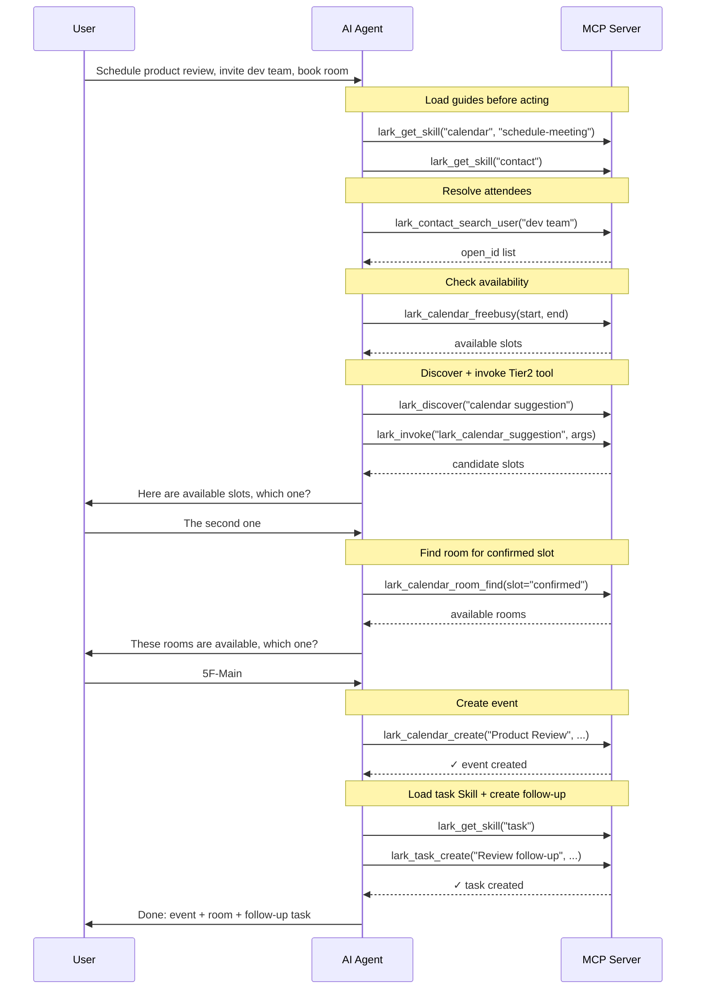

# Smart Orchestration (Skill)

lark-cli's official Skills capture per-domain multi-step best practices (parameter formats, call order, preconditions), but they originally required the client to shell-exec lark-cli and read local md files — out of reach for remote MCP clients. This project rewrites them into pure-MCP form, loaded on demand via `lark_get_skill`, so remote clients can also read these best practices before acting.

## Example

"Schedule a product review tomorrow with the dev team, book a room, and create follow-up tasks"

The AI's execution:

Skills are loaded on demand via `lark_get_skill` — no fixed context cost.

## 23 orchestration domains

| Domain | Coverage |
|---|---|
| calendar | Event create/edit, free/busy, room booking, recurring events, time suggestions |
| im | Send/reply messages, group management, message search, file download, reactions |
| doc | Document create/edit, content append/replace, whiteboard insert, XML protocol |
| base | Table/field/record/view/dashboard/workflow CRUD, data query & analysis |
| drive | Upload/download, search, import/export, comments, permissions, versioning |
| task | Create/update/complete tasks, tasklists, subtasks, attachments |
| mail | Send/receive, drafts, forward, reply, rules, contacts |
| sheets | Read/write cells, formulas, styles, dropdowns, filter views |
| wiki | Space/node create/move/copy/delete, member management |
| vc | Meeting search, minutes/transcript/recording retrieval |
| slides | Create/edit presentations, XML protocol, media upload |
| whiteboard | Query/edit boards, DSL/Mermaid/PlantUML input |
| okr | Cycles, objectives, key results, progress tracking |
| minutes | Search/download/upload minutes, speaker replacement |
| contact | User search, info lookup (name ↔ open_id) |
| markdown | Create/edit/compare Markdown files |
| approval | Approval instances and task management |
| apps | Miaoda app deployment/management |
| attendance | Clock-in record queries |
| vc-agent | Meeting bot join/leave, in-meeting events |
| openapi-explorer | Raw Feishu OpenAPI discovery |
| workflow-meeting-summary | Meeting notes compilation workflow |
| workflow-standup-report | Calendar + task daily summary |

## Maintenance

Skill files live in `docker/skills/`, transformed from lark-cli's official skills (see [bump-lark-cli](skills/bump-lark-cli.md) and [adapt-skill-for-mcp](skills/adapt-skill-for-mcp.md)). Re-adapt when upgrading lark-cli.
