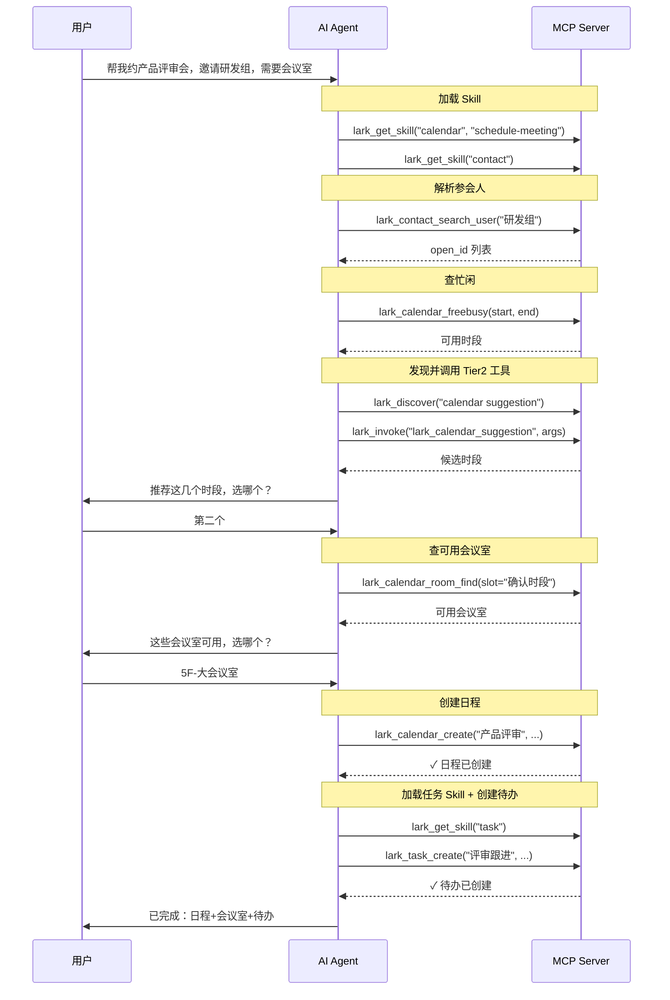

# 智能编排（Skill）

lark-cli 官方 Skill 沉淀了每个业务域多步操作的最佳实践（参数格式、调用顺序、前置条件），但原本依赖客户端 shell 执行 lark-cli + 读取本地 md 文件，支持远程 MCP 的客户端用不上。本项目把这些 Skill 改写成纯 MCP 形态，通过 `lark_get_skill` 按需加载——让远程客户端也能在操作前读到这些最佳实践。

## 示例

"帮我明天下午约一个产品评审会，邀请研发组的人，需要会议室，会后创建待办跟踪"

AI 的执行过程：

Skill 通过 `lark_get_skill` 按需加载，不占用固定 context。

## 编排域一览

| 域 | 覆盖场景 |
|---|---|
| calendar | 日程创建/编辑、忙闲查询、会议室预定、重复日程、时间推荐 |
| im | 发消息/回复、群管理、消息搜索、文件下载、表情回复 |
| doc | 文档创建/编辑、内容追加/替换、画板插入、XML 协议 |
| base | 多维表格建表/字段/记录/视图/仪表盘/工作流、数据查询分析 |
| drive | 文件上传/下载、搜索、导入导出、评论、权限、版本管理 |
| task | 任务创建/更新/完成、清单管理、子任务、附件上传 |
| mail | 收发邮件、草稿、转发、回复、规则、联系人 |
| sheets | 读写单元格、公式、样式、下拉列表、筛选视图 |
| wiki | 知识库空间/节点创建/移动/复制/删除、成员管理 |
| vc | 历史会议搜索、会议纪要/逐字稿/录制产物获取 |
| slides | 幻灯片创建/编辑、XML 协议、媒体上传 |
| whiteboard | 画板查询/编辑、DSL/Mermaid/PlantUML 输入 |
| okr | OKR 周期/目标/关键结果/进展管理 |
| minutes | 妙记搜索/下载/上传/说话人替换 |
| contact | 用户搜索/信息查询（姓名↔open_id） |
| markdown | Markdown 文件创建/编辑/比较 |
| approval | 审批实例/任务管理 |
| apps | 妙搭应用部署/管理 |
| attendance | 考勤打卡记录查询 |
| vc-agent | 会议机器人入会/离会/会中事件 |
| openapi-explorer | 原生飞书 OpenAPI 探索 |
| workflow-meeting-summary | 会议纪要整理工作流 |
| workflow-standup-report | 日程待办摘要工作流 |

## 维护

Skill 文件位于 `docker/skills/`，由 `scripts`（参见 [bump-lark-cli](skills/bump-lark-cli.md) 与 [adapt-skill-for-mcp](skills/adapt-skill-for-mcp.md)）从 lark-cli 官方 skill 转换而来。升级 lark-cli 时需重新适配。
